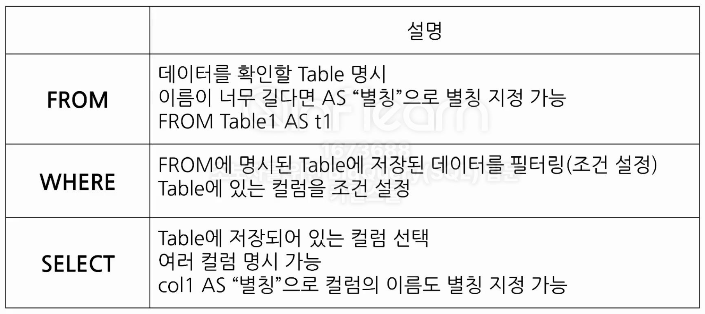
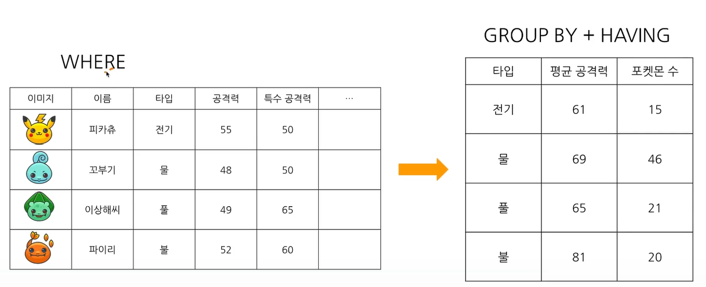
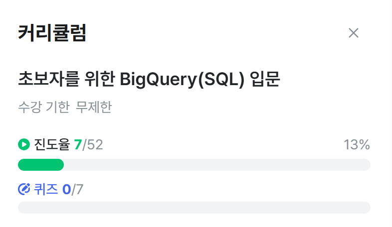

# SQL_BASIC 2주차 정규 과제 

📌SQL_BASIC 정규과제는 매주 정해진 분량의 `초보자를 위한 BigQuery(SQL) 입문` 강의를 듣고 간단한 문제를 풀면서 학습하는 것입니다. 이번주는 아래의 **SQL_Basic_2nd_TIL**에 나열된 분량을 수강하고 `학습 목표`에 맞게 공부하시면 됩니다.

**2주차 과제**는 1주차 과제처럼 SQL의 필요성이나 느낀점 위주가 아닌, **실제 강의 내용을 바탕으로 개념을 정리하고 학습한 내용을 집중적으로 기록**해주세요. 완성된 과제는 Github에 업로드하고, 링크를 스프레드시트 'SQL' 시트에 입력해 제출해주세요. 

**👀(수행 인증샷은 필수입니다.)** 

## SQL_BASIC_2nd

### 섹션 3. 데이터 탐색 - 조건, 추출, 요약

### 2-3. 데이터 탐색 (SELECT, FROM, WHERE)

### 2-4. SELECT 연습문제

### 2-5. 집계 (Group By + Having + Sum/Count)

## 🏁 강의 수강 (Study Schedule)

| 주차  | 공부 범위              | 완료 여부 |
| ----- | ---------------------- | --------- |
| 1주차 | 섹션 **1-1** ~ **2-2** | ✅         |
| 2주차 | 섹션 **2-3** ~ **2-5** | ✅         |
| 3주차 | 섹션 **2-6** ~ **3-3** | 🍽️         |
| 4주차 | 섹션 **3-4** ~ **4-4** | 🍽️         |
| 5주차 | 섹션 **4-4** ~ **4-9** | 🍽️         |
| 6주차 | 섹션 **5-1** ~ **5-7** | 🍽️         |
| 7주차 | 섹션 **6-1** ~ **6-6** | 🍽️         |

 

<!-- 여기까진 그대로 둬 주세요-->

---

# 1️⃣ 개념정리 

## 2-3. 데이터 탐색 (SELECT, FROM, WHERE)

~~~
✅ 학습 목표 :
* SQL 쿼리 구조를 이해할 수 있다. 
* SELECT, FROM, WHERE의 핵심 문법을 설명할 수 있다. 
~~~

<!-- 새롭게 배운 내용을 자유롭게 정리해주세요.-->
### SQL 쿼리 구조
#### SELECT
- 테이블의 어떤 컬럼을 선택(출력)할 것인가?
- Col1 AS new_name: Col1을 출력할 때 new_name으로 바꿈, AS 뒤의 변수명을 별칭이라 부르기도 함
- 세번째로 고려

#### FROM
- 어떤 테이블에서 데이터를 확인할 것인가? (보통 빅쿼리에서 이렇게 사용)
- FROM Dataset.Table
- 첫번째로 고려

#### WHERE
- WHERE: 만약 원하는 조건이 있다면 어떤 조건인가?
- 두번째로 고려
- 예시: name = '꼬부기'

#### 예시
##### 포켓몬 타입이 불인 포켓몬을 찾는 SQL 쿼리
SELECT 
 * 
FROM basic.pokemon 
WHERE 
 type1="Fire"
 ~~~
 basic이 데이터셋, pokemon이 테이블 
 *: 모든 컬럼을 출력, 용량 확인 가능, 행이 많으면 비용이 많이 발생 
 컬럼 몇개를 제외하고 출력하고 싶을 때는 '* EXCEPT(제외할 컬럼)'의 형태도 가능
 ~~~

##### 특정 Table에 있는 데이터를 추출
SELECT  
 col  
FROM  
Table

#### SQL 문법 핵심 정리

## 2-5. 집계 (Group By / HAVING / SUM,COUNT)

~~~
✅ 학습 목표 :
* 데이터를 집계하고 그룹화하는 방법을 설명할 수 있다.
* GROUP BY, HAVING, ORDER BY, 집계함수(SUM/COUNT 등)을 활용하는 방법을 설명할 수 있다.
* having과 where의 차이에 대해서 설명할 수 있다.
~~~

<!-- 새롭게 배운 내용을 자유롭게 정리해주세요.-->
### 집계 : GROUP BY
#### GROUP BY: 같은 값끼리 모아서 그룹화한다
- 특정 컬럼을 기준으로 모으면서 다른 컬럼에서 집계 가능(합, 평균, min, max 등)
##### 집계를 SQL로 표현해보기
SELECT 
 집계할 컬럼1, 
 집계 함수(COUNT, MAX, MIN 등) 
FROM table 
GROUP BY 
 집계할 컬럼1
 > 집계할 컬럼을 SELECT에 명시하고 그 컬럼을 꼭 GROUP BY에 작성
#### DISTINCT: 고유값을 알고 싶은 경우
- 여러 값 중에 Unique한 값만 보고 싶은 경우 사용
- DISTINCT는 중복을 제거하는 것
- COUNT(DISTINCT 컬럼)
##### DISTINCT를 SQL로 표현해보기
SELECT 
 집계할 컬럼, 
 COUNT(DISTINCT count할_컬럼) 
FROM table 
GROUP BY 
 집계할 컬럼
#### 그룹화 활용 포인트
- 일자별 집계: 원본 데이터는 특정 시간에 어떤 유저가 한 행동이 기록되어 있음
- 연령대별 집계: 특정 연령대에서 더 많이 구매했는가?
- 특정 타입별 집계: 특정 제품 타입을 많이 구매했는가?
- 앱 화면별 집계: 어떤 화면에 유저가 많이 접근했는가? 등등
#### 조건을 설정하고 싶은 경우: WHERE
- Table에 바로 조건을 설정하고 싶은 경우 사용
- RAW Data인 테이블 데이터에서 조건 설정
##### WHERE을 SQL로 표현해보기
SELECT 
 컬럼1, 컬럼2, 
 COUNT(컬럼1) AS col1_count 
FROM table 
WHRER
 컬럼1 >= 3
#### 조건을 설정하고 싶은 경우: HAVING
- GROUP BY한 후 조건을 설정하고 싶은 경우 사용
- 서브쿼리의 FROM 절에 다른 쿼리가 들어가는 경우
##### HAVING을 SQL로 표현해보기
SELECT 
 컬럼1, 컬럼2, 
 COUNT(컬럼1) AS col1_count 
FROM table 
GROUP BY 컬럼1, 컬럼2
HAVING
 col_count > 3
#### WHERE과 HAVING의 차이

- WHERE: Table에 바로 조건을 설정
- HAVING: GROUP BY한 후 조건을 설정
##### WHERE과 HAVING을 SQL로 표현해보기
SELECT 
 컬럼1, 컬럼2, 
 COUNT(컬럼1) AS col1_count 
FROM table 
WHERE
 컬럼1 >= 3
GROUP BY 컬럼1, 컬럼2
HAVING
 col_count > 3
#### 서브쿼리
- SELECT문 안에 존재하는 SELECT 쿼리
- FROM 절에 또 다른 SELECT문을 넣을 수 있음
- 괄호로 묶어서 사용
- 서브쿼리를 작성하고, 서브쿼리 바깥에서 WHERE 조건을 설정하는 것 = 서브쿼리에서 HAVING으로 하는 것
### 정렬: ORDER BY
- 순서: DESC(내림차순), OSC(오름차순-보통Default)
- ORDER BY는 쿼리의 맨 마지막에 두고, 쿼리의 맨 마지막에만 작성하면 됨(중간에 필요x)
##### ORDER BY를 SQL로 표현해보기
SELECT 
 col 
FROM 
ORDER BY <컬럼> <순서>
### 출력 개수 제한: LIMIT
- 쿼리문의 결과 ROW 수를 제한
- 쿼리문의 제일 마지막에 작성
##### ORDER BY를 SQL로 표현해보기
SELECT 
 col 
FROM 
LIMIT 10

### 요약, 집계, 그룹화 정리
- 집계하고 싶은 경우: GROUP BY + 집계함수
- 고유값을 알고 싶은 경우: DISTINCT
- 조건을 설정하고 싶은 경우: WHERE, HAVING
- 정렬하고 싶은 경우: ORDER BY
- 출력 개수를 제한하고 싶은 경우: LIMIT

# 2️⃣ 학습 인증란

  

---

# 3️⃣ 확인문제

## 문제 1

> **🧚Q. 포켓몬 마스터 승화는 포켓몬 데이터 조회하는 SQL문에 재미를 느껴서 혼자서 데이터를 조회하는 쿼리문을 짰습니다. 하지만 세 가지의 오류로 다음 코드가 실행이 안된다고 하는데, 각 오류의 위치와 이유를 설명하고, 올바른 쿼리문으로 수정해보세요.**

~~~sql
# 승화의 SQL Query문 
SELECT name AS '포켓몬 이름', ID;
WHERE type = 'Electric';
FROM pokemon;
~~~

~~~
1. '포켓몬 이름' => 작은 따옴표가 아닌 백틱을 사용해야 한다.
2. ID 뒤의 ; => FROM 전에 쿼리를 끝내버려서 실행 불가
3. WHERE은 FROM 뒤에 와야함.
[올바른 쿼리문]
SELECT 
 name AS `포켓몬 이름`, 
 ID
FROM pokemon
WHERE 
  type = 'Electric';
~~~

## 문제 2

> **🧚Q. 앞서 SQL Query의 오류를 해결한 승화는 기분 좋게 이번에는 포켓몬 데이터에서 타입별 평균 공격력이 60 이상인 타입만 조회하려는 쿼리를 작성하려고 했습니다. 하지만 이번에도 실수를 하여 쿼리문이 실행되지 않거나 잘못된 결과가 나오고 있는데, 쿼리에서 잘못된 부분이 무엇인지 설명하고, 올바르게 수정한 쿼리를 작성해보세요.**

~~~sql
SELECT type, AVG(attack) AS avg_attack
FROM pokemon
WHERE AVG(attack) >= 60
GROUP BY type;
~~~

~~~
집계 결과를 조건으로 필터링하기 위해서는 HAVING을 사용해야 한다.
[올바른 쿼리문]
SELECT 
  type, 
  AVG(attack) AS avg_attack
FROM pokemon
GROUP BY type
HAVING AVG(attack) >= 60
~~~

### 🎉 수고하셨습니다.
