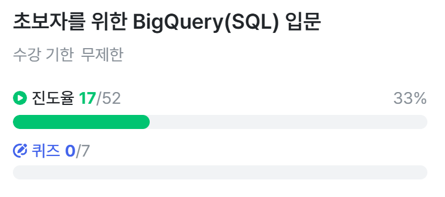

# SQL_BASIC 3주차 정규 과제 

📌SQL_BASIC 정규과제는 매주 정해진 분량의 `초보자를 위한 BigQuery(SQL) 입문` 강의를 듣고 간단한 문제를 풀면서 학습하는 것입니다. 이번주는 아래의 **SQL_Basic_3rd_TIL**에 나열된 분량을 수강하고 `학습 목표`에 맞게 공부하시면 됩니다.

**3주차 과제는 문제 풀이를 중심으로**, 강의에서 제시된 예제 문제 중 **7 문제 이상을 선택하여 직접 풀어본 뒤**, 강의 영상의 풀이와 비교해 **틀린 부분, 맞은 부분, 새롭게 배운 개념**을 구체적으로 정리해주세요. (적어도 3문제는 정리해야 합니다.) 완성된 과제는 Gihub에 업로드하고, 링크를 스프레드시트 'SQL' 시트에 입력해 제출해주세요.

**(수행 인증샷은 필수입니다.)** 

## SQL_BASIC_3rd

### 섹션 3. 데이터 탐색 - 조건, 추출, 요약

### 2-6. 연습문제 1~3번

### 2-6. 연습문제 7~9번

### 2-6. 연습문제 10~12번

### 2-6. 연습문제 13~17번

### 2-7. 정리 

### 2-8. 새로운 집계함수

## 섹션 4. 쿼리 잘 작성하기, 쿼리 작성 템플릿 및 오류를 잘 디버깅하기

### 3-1. INTRO

### 3-2. SQL 쿼리 작성하는 흐름

### 3-3. 쿼리 작성 템플릿과 생산성 도구 

## 🏁 강의 수강 (Study Schedule)

| 주차  | 공부 범위              | 완료 여부 |
| ----- | ---------------------- | --------- |
| 1주차 | 섹션 **1-1** ~ **2-2** | ✅         |
| 2주차 | 섹션 **2-3** ~ **2-5** | ✅         |
| 3주차 | 섹션 **2-6** ~ **3-3** | ✅         |
| 4주차 | 섹션 **3-4** ~ **4-4** | 🍽️         |
| 5주차 | 섹션 **4-4** ~ **4-9** | 🍽️         |
| 6주차 | 섹션 **5-1** ~ **5-7** | 🍽️         |
| 7주차 | 섹션 **6-1** ~ **6-6** | 🍽️         |

 

<!-- 여기까진 그대로 둬 주세요-->

---

# 1️⃣ 개념정리

## 2-6. 연습문제

~~~
✅ 학습 목표 :
* 연습문제(7문제 이상) 푼 것들 정리하기
~~~

<!-- 새롭게 배운 내용을 자유롭게 정리해주세요.-->
### 1. 포켓몬 중에 type2가 없는 포켓몬의 수를 작성하는 쿼리를 작성해주세요.
~~~
SELECT
  COUNT(id) AS cnt
FROM basic.pokemon
WHERE
  type2 IS NULL
~~~
### 2. type2가 없는 포켓몬의 type1과 type1의 포켓몬 수를 알려주는 쿼리를 작성해주세요.
~~~
SELECT
  type1,
  COUNT(id) AS cnt
FROM basic.pokemon
WHERE
  type2 IS NULL
GROUP BY 
  type1
ORDER BY 
  cnt DESC
~~~
### 3. type2 상관 없이 type1의 포켓몬 수를 알 수 있는 쿼리를 작성해주세요.
~~~
SELECT
  type1,
  COUNT(id) AS cnt
FROM basic.pokemon
GROUP BY 
  type1
~~~
### 4. 전설 여부에 따른 포켓몬 수를 알 수 있는 쿼리를 작성해주세요.
~~~
SELECT
  is_legendary,
  COUNT(id) AS cnt
FROM basic.pokemon
GROUP BY 
  is_legendary
~~~
### 5. 동명 이인이 있는 이름은 무엇일까요?
~~~
SELECT
  name,
  COUNT(name) AS cnt
FROM basic.trainer
GROUP BY 
  name
HAVING
  cnt >= 2
~~~
### 6. trainer 테이블에서 "Iris" 트레이너의 정보를 알 수 있는 쿼리를 작성해주세요.
~~~
SELECT
  *
FROM basic.trainer
WHERE
  name = "Iris"
~~~
### 7. trainer 테이블에서 "Iris", "Whitney", "Cynthia" 트레이너의 정보를 알 수 있는 쿼리를 작성해주세요.
~~~
SELECT
  *
FROM basic.trainer
WHERE
  name IN ("Iris", "Whitney", "Cynthia")
~~~

## 2-8. 새로운 집계함수

~~~
✅ 학습 목표 :
* SQL 쿼리 구조를 이해할 수 있다. 
* SELECT, FROM, WHERE을 활용하는 방법을 설명할 수 있다. 
~~~

<!-- 새롭게 배운 내용을 자유롭게 정리해주세요.-->

### 데이터 탐색 과정
> 어떤 일을 해야함 - 원하는 것을 정함 - 데이터 탐색 - 데이터 결과 검증 - 피드백/활용

### 데이터 탐색
다량의 자료는 JOIN 후 진행
- 조건(필터링): WHERE, HAVING
- 추출: SELECT
- 변환
- 요약: GROUP BY (AVG, COUNT, COUNTIF, SUM, MAX, MIN 등)

## 3-2. 쿼리를 작성하는 흐름

~~~
✅ 학습 목표 :
* 쿼리를 작성하는 흐름을 설명할 수 있다.
~~~

<!-- 새롭게 배운 내용을 자유롭게 정리해주세요.-->

### 1. 지표 고민
어떤 문제를 해결하기 위해 데이터가 필요한가?
### 2. 지표 구체화
추상적이지 않고 구체적인 지표 명시(분자, 분모를 표시하는 게 좋음)
### 3. 지표 탐색
유사한 문제를 해결한 케이스가 있나 확인
- 존재한다면 해당 쿼리 리뷰하는 방식 채택
- 존재하지 않는다면 퀴리 작성
### 4. 쿼리 작성
데이터가 있는 테이블 찾기
- 2개 이상이라면 연결 방법을 고민(JOIN)
### 5. 데이터 적합성 확인
예상한 결과와 동일한지 확인
### 6. 쿼리 가독성
나중을 위해 깔끔하게 쿼리 작성
### 7. 쿼리 저장
쿼리는 재사용되므로 문서로 저장

## 3-3. 쿼리 작성 템플릿과 생산성 도구

~~~
✅ 학습 목표 :
* 생산성 도구를 만들 수 있다.
~~~

<!-- 이어질 주차에서 생산성 도구를 활용한 실습이 있습니다.강의에 맞게 제작하여 화면을 캡쳐하여 이 주석을 지우고 올려주세요. -->
### 쿼리 작성 템플릿
쿼리를 작성하는 목표, 확인할 지표:
쿼리 계산 방법:
데이터의 기간:
사용할 테이블: 
JOIN KEY: 
데이터 특징: 

SELECT

FROM
WHERE

> 템플릿을 수월하게 사용하기 위해 생산성 도구를 활용 - espanso

 
 

---

# 2️⃣ 학습 인증란

  

---

# 3️⃣ 확인문제

## 문제 1

> **🧚Q. 포켓몬 게임에 재미를 느낀 동혁은 포켓몬 도감에서 강력한 포켓몬 타입을 미리 선점하기 위해, 먼저 어떤 포켓몬들이 있는지 포켓몬 수를 기준으로 내림차순 정렬하여  확인하고자 했습니다.**
>
> 그래서 다음과 같은 필요한 정보를 미리 정리해보았습니다. 

~~~
조건 : type2는 상관없이
보고 싶은 컬럼 : type1
집계 내용 : 각 type1 별 포켓몬 수
정렬 기준 : 포켓몬 수를 기준으로 내림차순 정렬
~~~

> **이 목표를 바탕으로 동혁이 아래와 같은 쿼리를 잘 작성했지만, 일부 SQL 문법 요소를 빼먹었습니다. 비어 있는 부분인 ㄱ,ㄴ,ㄷ 에 들어갈 알맞은 SQL 구문을 채워보세요:**

~~~sql
SELECT type1, (ㄱ)
FROM pokemon
(ㄴ) type1
ORDER BY (ㄱ) (ㄷ);
~~~

~~~
(ㄱ) COUNT(*)
(ㄴ) GROUP BY
(ㄷ) DESC
~~~

### 🎉 수고하셨습니다.
