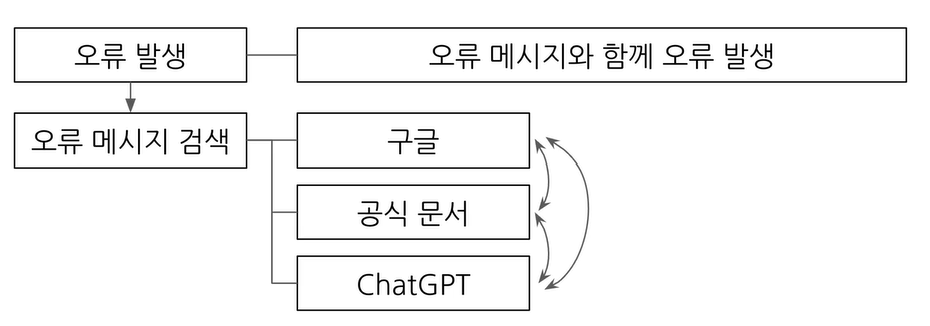
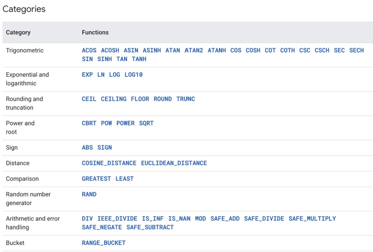
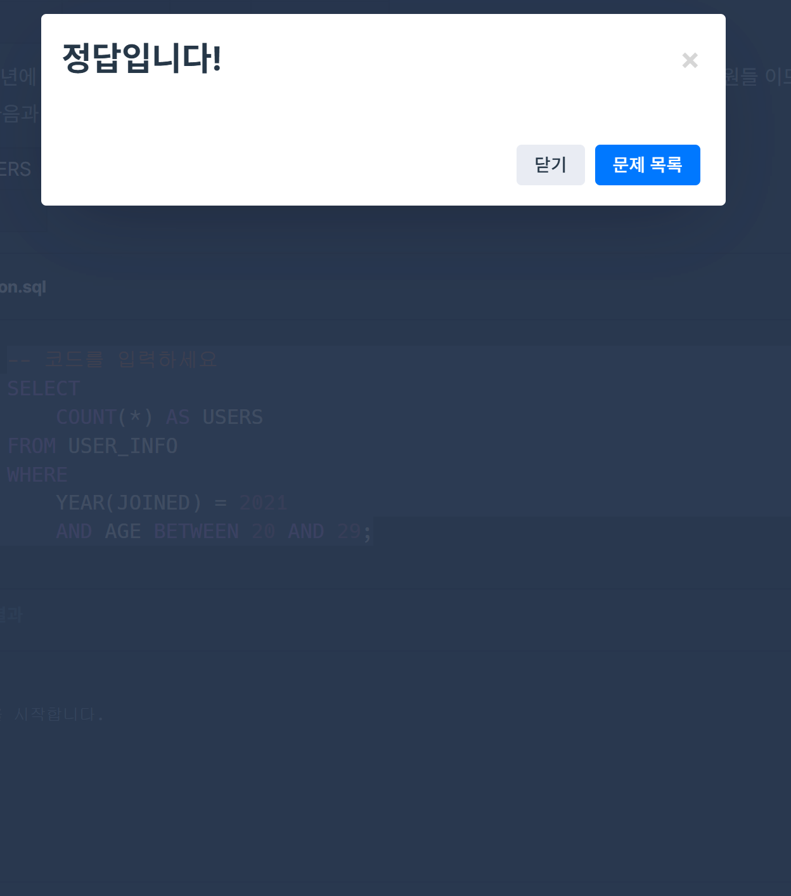

# SQL_BASIC 4주차 정규 과제 

📌SQL_BASIC 정규과제는 매주 정해진 분량의 `초보자를 위한 BigQuery(SQL) 입문` 강의를 듣고 간단한 문제를 풀면서 학습하는 것입니다. 이번주는 아래의 **SQL_Basic_4th_TIL**에 나열된 분량을 수강하고 `학습 목표`에 맞게 공부하시면 됩니다.

**4주차 과제부터는 강의 내용을 정리하는 것과 함께, 프로그래머스에서 제공하는 SQL 문제를 직접 풀어보는 실습도 병행합니다.** 강의에서는 **배운 내용을 정리하고 주요 쿼리 예제를 정리**하며, 프로그래머스 문제는 **직접 풀어본 뒤 풀이 과정과 결과, 배운 점을 함께 기록**해주세요. 완성된 과제는 Github에 업로드하고, 링크를 스프레드시트 'SQL' 시트에 입력해 제출해주세요.

**(수행 인증샷은 필수입니다.)** 

## SQL_BASIC_4th

### 섹션 4. 쿼리 잘 작성하기, 쿼리 작성 템플릿 및 오류를 잘 디버깅하기

### 3-4. 오류를 잘 디버깅하는 방법


## 섹션 5. 데이터 탐색 - 변환

### 4-1. INTRO

### 4-2. 데이터 타입과 데이터 변환(CAST, SAFE_CAST)

### 4-3. 문자열 함수(CONCAT, SPLIT, REPLACE, TRIM, UPPER)

### 4-4. 날짜 및 시간 데이터 이해하기(1) (타임존, UTC, Millisecond, TIMESTAMP/DATETIME)


## 🏁 강의 수강 (Study Schedule)

| 주차  | 공부 범위              | 완료 여부 |
| ----- | ---------------------- | --------- |
| 1주차 | 섹션 **1-1** ~ **2-2** | ✅         |
| 2주차 | 섹션 **2-3** ~ **2-5** | ✅         |
| 3주차 | 섹션 **2-6** ~ **3-3** | ✅         |
| 4주차 | 섹션 **3-4** ~ **4-4** | ✅         |
| 5주차 | 섹션 **4-4** ~ **4-9** | 🍽️         |
| 6주차 | 섹션 **5-1** ~ **5-7** | 🍽️         |
| 7주차 | 섹션 **6-1** ~ **6-6** | 🍽️         |

<br>

<!-- 여기까진 그대로 둬 주세요-->

---

# 1️⃣ 개념정리

## 3-4. 오류를 디버깅하는 방법

~~~
✅ 학습 목표 :
* 오류의 정의에 대해 설명할 수 있다. 
* 오류 메시지를 보고 디버깅이라는 과정을 수행할 수 있다. 
~~~

<!-- 새롭게 배운 내용을 자유롭게 정리해주세요.-->

### SQL 쿼리 작성 중 발생하는 오류

#### Error의 정의
- 부정확하거나 잘못된 행동을 의미
- 실수와 동의어인 경우도 있음
- 오류메세지가 알려주고자 하는 것
  - 길잡이 역할: 현재 작성한 방식으로는 답을 얻을 수 없음
  - 문제 진단: 이 부분이 문제가 됨


#### Syntax error: 문법 오류


- 문법을 지키지 않아 생기는 오류
- Error Message를 해석 후, 해결 방법 탐색
  - 구글 검색
  - ChatGPT 질문
    - 데이터 예시나 쿼리를 제공 후 오류가 발생한 것을 말해보기
  - 커뮤니티 질문

##### 대표적인 Syntax error
~~~
0. 밑줄이 나타났다면, 밑줄 앞이나 뒤에 error가 있을 가능성이 큼

1. SELECT list must not be empty at [10:1]
  - 해석: SELECT 목록은 [10:1]에서 비어 있으면 안됨
  * [10:1]: 10번째 줄 1번째 칸
  - 원인: SELECT와 FROM 사이가 비어있기 때문에 발생
  - 해결: SELECT와 FROM 사이에 col 명을 적어주기

2. Number of arguments does not match for aggregate function COUNT
  - 해석: 집계 함수 COUNT의 인자 수가 일치하지 않음
  - 원인: COUNT(name, Kor_name)처럼 COUNT() 안에는 여러가지 인자가 들어가면 안됨
  - 해결: COUNT() 안에 하나의 인자만 넣기

3. SELECT list expression references column type1 a which is neither grouped nor aggregated
  - 해석: SELECT 절에 있는 type1 컬럼이 그룹화되지도 않고 집계 함수로 묶이지도 않음
  - 원인: GROUP BY에 적절한 컬럼을 명시하지 않음
  - 해결: 하단에 GROUP BY type1을 작성

4. Expected end of input but got keyword SELECT
  - 해석: 입력이 끝날 것으로 예상되었지만 SELECT 키워드가 입력됨
  - 원인: 여러개의 쿼리를 실행시키면서 하나의 쿼리가 끝날 때 ;을 붙이지 않음
  - 해결: 쿼리가 끝나는 부분에 ;을 붙이기

5. Expected end of input but got keyword WHERE at [5:1]
  - 해석: 입력이 끝날 것으로 예상되었지만 [5:1]에서 키워드 WHERE를 얻음
  - 원인: WHERE 바로 직전 LIMIT이 입력됨
  - 해결: LIMIT을 쿼리의 맨 아래에 위치시키기

6. Expected ")" but got end of script at [8:11]
  - 해석: ")"가 예상되지만 [8:11]에서 스크립트가 끝남
  - 원인: 닫는 괄호 ")"가 작성되지 않음
  - 해결: ")"을 작성
~~~  


## 4-2. 데이터 타입과 데이터 변환(CAST, SAFE_CAST)

~~~
✅ 학습 목표 :
* 데이터 타입의 종류를 설명할 수 있다. 
* 데이터 타입을 변환하는 방법을 설명할 수 있다. 
~~~

<!-- 새롭게 배운 내용을 자유롭게 정리해주세요.-->

### 데이터 변환 개요
- SELECT 문에서 데이터를 변환시킬 수 있음
- WHERE의 조건문에도 사용할 수 있음
- 데이터의 타입에 따라 다양한 함수가 존재

### 데이터 타입
- 숫자
  - 정수, 소수점
  - 1, 2, 3.14, ..
- 문자
  - " "로 구성되는 것
  - "나", "고양이", ..
- 시간, 날짜
  - 2024-01-01, 2024-01-01 23:59:10, ..
- Bool(부울)
  - TRUE/FALSE를 구분
- JSON
- ARRAY
이외에도 다양한 데이터 타입이 존재

#### 데이터 타입이 중요한 이유
보이는 것과 저장된 것의 차이가 존재
- 엑셀의 빈 값: ""일 수도, NULL일 수도 있음
- 1이라고 작성된 경우: 숫자 1일 수도, 문자 1일 수도 있음
- 2023-12-31: DATE 2023-12-31일 수도, 문자 2023-12-31일 수도 있음

### 자료 타입 변경하기 - CAST
```sql
SELECT
  CAST(1 AS STRING) # 숫자 1을 문자 1로 변경

SELECT
  CAST("고양이" AS INT64) # 문자열을 숫자로 바꿀 수 없기 때문에 오류 발생

SELECT
  SAFE_CAST("고양이" AS INT64) # NULL 반환
# SAFE_가 붙은 함수는 변환 실패 시 NULL 반환
```

### 수학 함수
수학 연산(평균, 표준편차, 코사인 등)이 존재




- 암기할 필요는 없음, 필요할 때 찾기
- 나누기를 할 경우 x/y 대신 SAFE_DEVIDE(x, y) 사용하기
  - x, y 중 하나라도 0인 경우 그냥 나누면 zero error 발생


## 4-3. 문자열 함수(CONCAT, SPLIT, REPLACE, TRIM, UPPER)

~~~
✅ 학습 목표 :
* 문자열 함수들의 종류를 이해하고 어떠한 상황에서 사용하는지 설명할 수 있다. 
~~~

<!-- 새롭게 배운 내용을 자유롭게 정리해주세요.-->

### 문자열(STRING) 함수
문자열 데이터로 할 수 있는 대표적인 연산

| 연산 | Input | Output | 함수이름 |
|------|------|-------|---------|
| 문자열 붙이기 | "안녕" + "하세요" | "안녕하세요" | CONCAT |
| 문자열 분리하기 | "가,나,다,라" | "가", "나", "다", "라" | SPLIT |
| 특정 단어 수정하기 | "안녕하세요" | "실천하세요" | REPLACE |
| 문자열 자르기 | "안녕하세요" | "안녕" | TRIM |
| 영어 대문자 변환 | "ab" | "AB" | UPPER |

```sql
# 문자열 붙이기 => CONCAT
# CONCAT("컬럼1", "컬럼2", ...)
# CONCAT 인자로 STRING이나 숫자를 넣을 때는 데이터를 직접 넣은 것임
# FROM이 없어도 실행됨

SELECT
  CONCAT("안녕", "하세요", "!") AS result


# 문자열 분리하기 => SPLIT
# SPLIT("문자열_원본", "나눌 기준이 되는 문자")
# ", ": 띄어쓰기도 하나의 문자로 인식하므로 띄어쓰기도 포함해서 작성
# 결과가 배열(ARRAY)로 나옴

SELECT
  SPLIT("가, 나, 다, 라", ", ") AS result


# 특정 단어 수정하기 => REPLACE
# REPLACE("문자열_원본", "찾을 단어", "바꿀 단어")

SELECT
  REPLACE("안녕하세요", "안녕", "실천") AS result


# 문자열 자르기 => TRIM
# TRIM("문자열_원본", "자를 단어")

SELECT
  TRIM("안녕하세요", "하세요") AS result


# 영어 소문자를 대문자로 변경 => UPPER
# UPPER("문자열_원본")

SELECT
  UPPER("abc") AS result
```


## 4-4. 날짜 및 시간 데이터 이해하기(1) (타임존, UTC, Millisecond, TIMESTAMP/DATETIME)

~~~
✅ 학습 목표 :
* 날짜 및 시간 데이터 타입과 UTC의 개념을 설명할 수 있다. 
* DATE, DATETIME, TIMESTAMP 에 대해서 설명할 수 있다.
* 시간함수들의 종류와 시간의 차이를 추출하는 방법을 설명할 수 있다. 
~~~

<!-- 새롭게 배운 내용을 자유롭게 정리해주세요.-->

### 날짜 및 시간 데이터의 핵심
~~~
0. 일반적인 시간과 개발에서의 시간은 개념적 차이가 존재
1. 날짜 및 시간 데이터 타입 파악하기
  - DATE, DATETIME, TIMESTAMP
2. 날짜 및 시간 데이터 관련 알면 좋은 내용
  - UTC, Millisecond
3. 날짜 및 시간 데이터 타입 변환하기
4. 시간 함수
  - 두 시간의 차이, 특정 부분 출력하기
~~~

### 시간 데이터 다루기
시간 데이터도 세부적으로 나눌 수 있음<br>

#### DATE, DATETIME, TIME
- DATE: DATE만 표시하는 데이터
  - 2023-12-22
- DATETIME: DATE와 TIME까지 표시하는 데이터
  - Time Zone 정보 없음
  - 2022-10-33 14:00:00
- TIME: 날짜와 무관하게 시간만 표시하는 데이터
  - 23:59:12.00

#### 타임존
- GMT: Greenwhich Mean Time
  - 한국 시간: GMT +9
  - 영국의 그리니치 천문대(경도 0도)를 기준으로 하는 시간의 구분선
  - 영국 근처에서 자주 활용
- UTC: Universal Time Coordinated
  - 한국 시간: UTC +9
  - 협정 세계시
  - 타임존이 존재한다 == 특정 지역의 표준 시간대
- TIMESTAMP: 시간 도장
  - UTC로부터 경과한 시간을 나타내는 값
  - Time Zone 정보 있음
  - 2023-12-31 10:00:00 UTC

#### millisecond, microsecond
- millisecond(ms)
  - 시간의 단위(1000ms = 1초)
  - 빠른 반응이 필요한 분야에서 사용
  - Millisecond -> TIMESECOND -> DATETIME으로 변경
- microsecond(µs)
  - 1/1,000ms, 1/1,000,000초
- 예시: 1704176819711ms
  - 이를 DATETIME으로 변환하면 2024-01-02 15:26:59(DATETIME)
```sql
SELECT
  TIMESTAMP_MILLIS(1704176819711) AS milli_to_timestamp_value,
  TIMESTAMP_MICROS(1704176819711000) AS micro_to_timestamp_value,
  DATETIME(TIMESTAMP_MICROS(1704176819711000)) AS datetime_value1,
  DATETIME(TIMESTAMP_MILLIS(1704176819711)) AS datetime_value2,
  DATETIME(TTIMESTAMP_MICROS(1704176819711000), 'Asia/Seoul') AS datetime_asia;

# datetime_value1와 datetime_value2은 같은 결과 출력
# datetime_value1은 UTC 기준 시간, datetime_asia은 서울 기준 시간
# datetime_asia = datetime_value1 + 9시간
```

#### 시간 데이터끼리의 변환
- 많은 회사들의 Table에 시간이 TIMESTAMP로 저장된 경우가 많지만 DATETIME으로 저장되어있기도 함
- 따라서 TIMESTAMP <-> DATETIME 변환을 해야 할 수도 있음

```sql
SELECT
  CURRENT_TIMESTAMP() AS timestamp_col,
  DATETIME(CURRENT_TIMESTAMP(), 'Asia/Seoul') AS datetime_col

# timestamp_col 출력: 2024-01-18 11:55:11.536268 UTC
# datetime_col 출력: 2024-01-18T20:55:11.536268 UTC
```

| | TIMESTAMP | DATETIME |
|---|---|---|
| 타임존 | UTC라고 나옴 | T가 나옴(TIME을 의미) |
| 시간 차이 | 한국 시간 - 9시간 | 한국 Zone 사용시 한국 시간과 동일 |


<br>

<br>

---

# 2️⃣ 확인문제 & 문제 인증

## 프로그래머스 문제 

> 조건에 맞는 회원 수 구하기 (SELECT, COUNT) 
>
> **먼저 문제를 풀고 난 이후에 확인 문제를 확인해주세요**
>
> 문제 링크 
>
> :  https://school.programmers.co.kr/learn/courses/30/lessons/131535#

<!-- 문제를 풀기 위하여 로그인이  필요합니다. -->




## 문제 1

> **🧚Q. 프로그래머스 문제를 풀던 서현이는 여러 번의 시행착오 끝에 결국 혼자 해결하기 어려워 오류 메시지를 공유하며 도움을 요청했습니다. 여러분들이 오류 메시지를 확인하고, 해당 SQL 쿼리에서 어떤 부분이 잘못되었는지 오류 메시지를 해석하고 찾아 설명해주세요.**

~~~sql
# 조건에 맞는 회원 수 구하기 (SELECT, COUNT) 
# 서현이의 SQL 첫 번째 풀이
SELECT COUNT(AGE, JOINED)
FROM USER_INFO
WHERE AGE BETWEEN 20 AND 29
  AND JOINED BETWEEN '2021-01-01' AND '2021-12-31';
  
오류 메시지 : Error: Number of arguments does not match for aggregate function COUNT
 
# 수정하고 난 이후 두 번째 풀이
SELECT AGE, COUNT(*)
FROM USER_INFO
WHERE AGE BETWEEN 20 AND 29
  AND JOINED BETWEEN '2021-01-01' AND '2021-12-31';
  
오류 메시지 : SELECT list expression references column AGE which is neither grouped nor aggregated
~~~


~~~
1. COUNT()는 인자를 하나만 허용하기 때문에 COUNT(*)로 작성해야 함
오류 메세지 해석: 집계 함수 COUNT의 인자 수가 일치하지 않음
2. 쿼리 맨 아래에 GROUP BY AGE;를 작성해야 함
오류 메세지 해석: SELECT 절에 있는 AGE 컬럼이 그룹화되지도 않고 집계 함수로 묶이지도 않음
~~~


### 🎉 수고하셨습니다.
