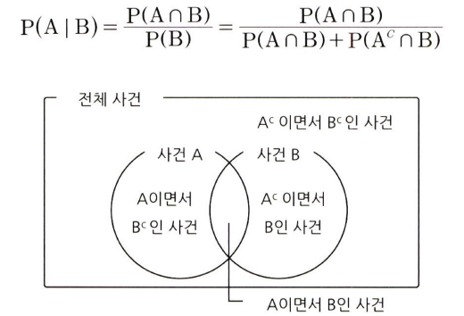
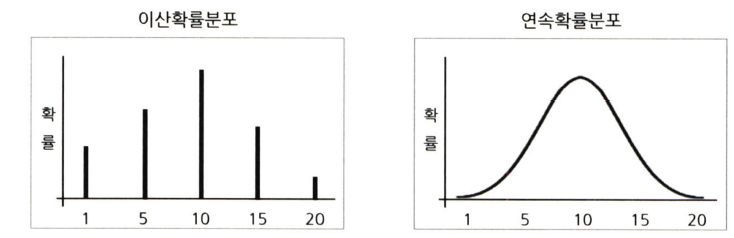
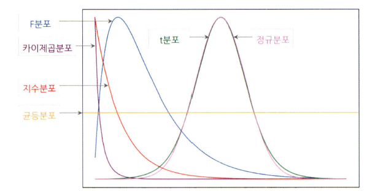
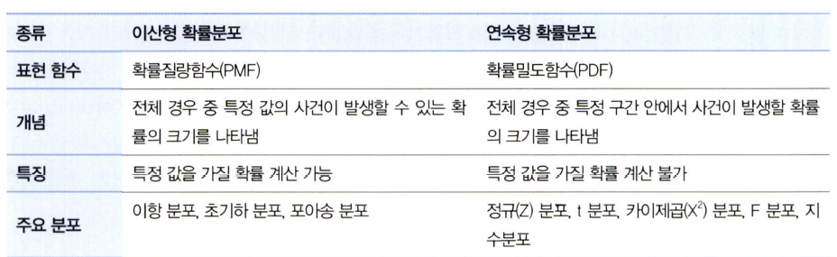
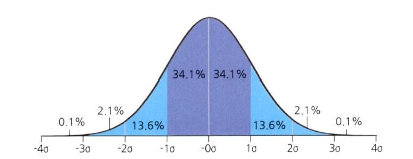
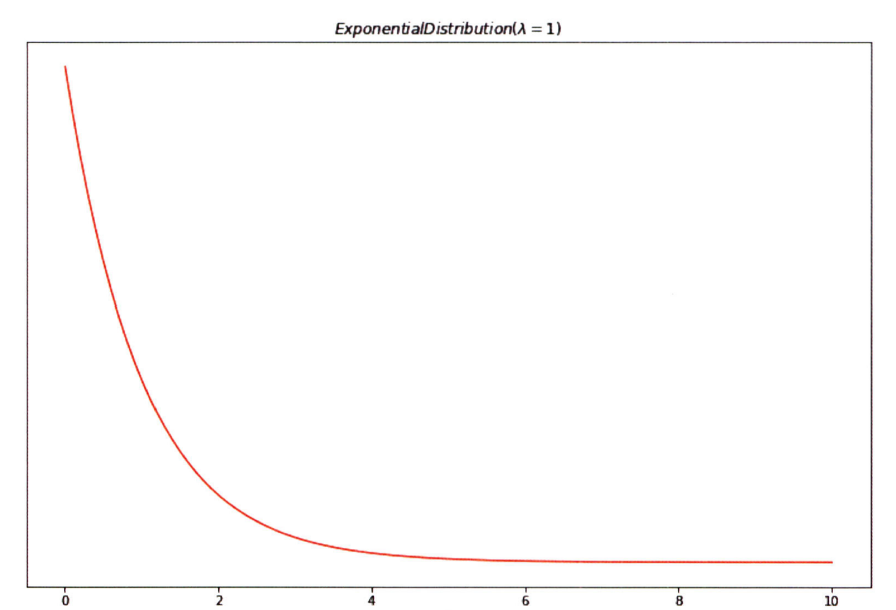
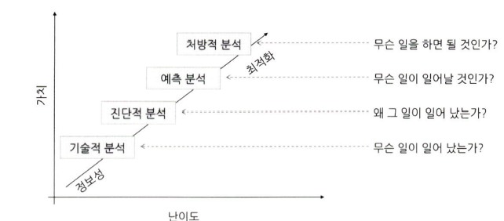

# 통계학 2주차 정규과제

📌통계학 정규과제는 매주 정해진 분량의 『*데이터 분석가가 반드시 알아야 할 모든 것*』 을 읽고 학습하는 것입니다. 이번 주는 아래의 **Statistics_2nd_TIL**에 나열된 분량을 읽고 `학습 목표`에 맞게 공부하시면 됩니다.

아래의 문제를 풀어보며 학습 내용을 점검하세요. 문제를 해결하는 과정에서 개념을 스스로 정리하고, 필요한 경우 추가자료와 교재를 다시 참고하여 보완하는 것이 좋습니다.

2주차는 `1부. 데이터 기초체력 기르기`를 읽고 새롭게 배운 내용을 정리해주시면 됩니다.


## Statistics_2nd_TIL

### 1부. 데이터 기초체력 기르기

### 05. 확률과 확률변수

### 06. 확률분포
### 07. 가설검정


## Study ScheduleStudy Schedule

| 주차  | 공부 범위     | 완료 여부 |
| ----- | ------------- | --------- |
| 1주차 | 1부 p.2~46    | ✅         |
| 2주차 | 1부 p.47~81   | ✅         |
| 3주차 | 2부 p.82~120  | 🍽️         |
| 4주차 | 2부 p.121~167 | 🍽️         |
| 5주차 | 2부 p.168~202 | 🍽️         |
| 6주차 | 3부 p.203~250 | 🍽️         |
| 7주차 | 3부 p.251~299 | 🍽️         |

<!-- 여기까진 그대로 둬 주세요-->


# 1️⃣ 개념 정리 
## 05. 확률과 확률변수

```
✅ 학습 목표 :
* 확률변수의 개념과 종류를 설명할 수 있다.
* 심슨의 역설을 설명하고, 발생 원인을 식별하며, 이를 해결하기 위한 방안을 도출할 수 있다.
```

<!-- 새롭게 배운 내용을 자유롭게 정리해주세요.-->
### 확률의 기본 개념
#### 확률
- 일정한 조건 안에서 특정 사건이 일어날 수 있는 가능성의 정도
- 확률의 범위: [0,1]
- 확률=0: 절대 발생하지 않음
- 확률=1: 항상 발생함
#### 표본공간
- 통계적 실험을 통해 발생할 수 있는 모든 사건의 집합
- 표본 점: 한번의 실험을 통해 발생할 수 있는 특정한 결과 혹은 표본공간의 부분집합
### 확률의 종류
#### 비조건확률
- 아무런 조건이 없는 상황에서 사건이 일어날 확률
- 한계확률이라고도 불림
- P(A), P(B)
#### 결합확률
- 표본공간 안에서 일어나는 사건 각각의 조합으로 이루어지는 확률, 두 개 이상의 사건이 동시에 일어나는 확률
- P(A∩B)
#### 조건부확률
- 하나의 사건이 먼저 발생했다는 조건이 전제된 상황에서 또 다른 사건이 발생할 확률
- 표본공간을 한정 지은 다음, 다른 조건의 확률을 구하기 때문에 조건부 확률은 결합확률보다 확률 값이 높게 측정됨
- P(B|A), A가 전제되는 조건

### 분할과 베이지안
#### 분할의 개념
- 사건들을 모두 합했을 때 전체 사건들을 포괄하되, 중복이 일어나지 않는 사건들의 집합
- MECE와 비슷함


#### 베이지안 이론
P(A): A의 사전 확률
P(B): B의 사전 확률
P(B|A): 사건 A가 전제됐을 때 사건 B의 조건부확률 (우도확률)
P(A|B): 사건 B가 발생했다는 조건에서 사건 A가 발생했을 확률 (사후확률)
- 사건 발생 전에 이미 가지고 있는 사전확률 P(A)와 우도확률 P(B|A)를 안다면 사후확률 P(A|B)를 계산할 수 있다
### 확률변수의 개념과 종류
#### 확률변수의 개념
- 측정 값이 변할 수 있는 확률이 주어진 변수
- 표본평균, 표본분산 등: 표본추출에 따라 통계량이 달라짐
- 표본공간의 크기에 따라 확률이 달라짐
- 이산확률변수: 변수가 가질 수 있는 값이 countable한 실수, 분포를 그리면 각 값의 지점이 점으로 찍힘
- 연속확률변수: 연속형 값을 가짐, uncountable한 변수, 가질 수 있는 값이 무한대이기 때문에 특정 값을 가질 확률은 0임
- 연속확률변수는 특정 값이 아닌 특정 구간이 나올 수 있는 확률을 구하는 식으로 접근


### 심슨의 역설
- 데이터를 어떻게 나누고 결합하고 가공하는가에 따라 결과가 정반대로 바뀔 수 있음을 경계해야 한다
~~~
1. 지원자수 대비 남성 합격률이 44%, 여성 합격률이 35%로 나타남
2. 세부 학과별로 나누어 상위 학과들의 남녀 학생의 합격률을 보니 6개 중 4개 학과의 여성 합격률이 높게 나타남
3. 여성 합격률이 낮은 이유는 여성들은 경쟁률이 높은 학과에 주로 지원하는 반면, 남성들은 공과대학같은 비교적 경쟁률이 낮은 학과에 지원하는 경향이 있기 때문
4. 따라서 여성 합격률이 낮다고 성별에 따른 입학 차별을 두지 않았음. 이걸 왜곡하면 안된다는 것이 심슨의 역설
~~~


## 06. 확률분포

```
✅ 학습 목표 :
* 이산확률분포의 종류와 특징을 설명할 수 있다.
* 연속확률분포의 종류와 특징을 설명할 수 있다. 
* 중심극한정리(CLT)의 개념을 이해하고 설명 할 수 있다.
```



### 06.2. 이산확률분포

> **🧚 이산확률분포에 대해 학습한 내용을 정리해주세요.**

<!--수식과 공식을 암기하기보다는 분포의 개념과 특성을 위주로 공부해주세요. 분석 대상의 데이터가 어떠한 확률분포의 특성을 가지고 있는지를 아는 것이 더 중요합니다.-->

#### 균등분포
- 결과 X가 동일한 확률을 가지는 분포
- 주사위를 던져서 특정 숫자가 나오는 결과 X
#### 이항분포(binomial dist'n)
- 1과 0의 값만을 갖는 분포
- 동전의 앞/뒤, 성공/실패
##### 베르누이 시행
- 이항분포를 나타낼 수 있는, 결과가 두 가지 중 하나만 나오는 시행
- 각각의 결과가 독립
#### 초기하분포(hypergeometric dist'n)
- 각 시행이 서로 독립적이지 않아서 시행마다 성공할 확률이 달라지는 비복원추출
#### 포아송분포(poisson dist'n)
- 일정한 관측 공간에서 특정 사건이 발생하는 횟수
- 품질관리나 보험상품 개발 등에 사용됨
- 특정 연령대 구간에 평균적으로 몇 번의 교통사고를 당하는지?
- 0과 1의 개념 및 표본의 크기라는 개념이 존재하지 않음
- 발생하는 사건은 양의 정수 형태를 가짐
- 모든 사건은 독립적으로 발생
- 해당 시공간에서 사건의 발생 비율은 항상 같음(시공간이 두배로 늘어나면 발생하는 사건도 두배로 늘어남)
- 한번에 둘 이상의 사건이 발생하지 않음
- λ: 특정 시공간 안에서의 평균 사건 발생 횟수

### 06.3. 연속확률분포

> **🧚 연속확률분포에 대해 학습한 내용을 정리해주세요.**

<!--수식과 공식을 암기하기보다는 분포의 개념과 특성을 위주로 공부해주세요. 분석 대상의 데이터가 어떠한 확률분포의 특성을 가지고 있는지를 아는 것이 더 중요합니다.-->

- 단위를 세분화하여 히스토그램을 곡선 형태의 분포로 만들면 그것이 연속확률분포 또는 확률밀도곡선이 됨

#### 정규분포
- 가장 대표적인 연속확률 분포
- 가우스 분포라 부르기도 함
- 모집단에서 추출한 표본에서 계산된 평균과 비율도 정규분포를 따름
- 평균=중앙값=최빈값
- 표준정규분포 Z = (확률변수 X의 편차)/(표준편차)


#### 지수분포
- 특정 사건이 발생한 시점으로부터 다음 사건이 발생할 때까지의 시간을 확률변숫값으로 하는 분포


- 확률변수 X가 증가할수록 사건이 발생할 확률이 지수적으로 감소함
- 평균에 따라 기울기가 정해짐
- 1/λ: 하나의 사건이 발생한 후 다음 사건이 발생하기까지의 평균 소요 시간


## 06.4. 중심극한정리

> **🧚 중심극한정리에 대해 학습한 내용을 정리해주세요.**

- 표본의 통계치를 통해 어떻게 모집단을 추정할 수 있는가? => 중심극한정리를 통해 설명 가능
- 데이터의 크기가 일정한 양을 넘으면 평균의 분포는 정규분포에 근사한다는 이론
- 모집단으로부터 무작위로 표본을 여러 번 추출한 다음, 추출된 각각의 표본들의 평균을 분포로 그려보면 정규분포의 형태를 가짐
- 이는 표본의 양이 충분하면 표본평균이 모집단의 평균과 유사해진다는 것이 아님, 표본을 여러번 추출했을 때 '각각의 표본'의 평균들의 분포가 정규분포를 이룬다는 것임
- 이를 통해 전수 조사 없이도 표본 평균의 분포를 알 수 있으므로 모집단 평균에 대한 신뢰 구간을 더 쉽게 얻을 수 있음

## 07. 가설검정

```
✅ 학습 목표 :
* 귀무가설과 대립가설의 개념을 정의하고, 주어진 연구 질문에 적절한 가설을 설정할 수 있다.
* 가설검정의 유의수준과 p값의 개념을 설명하고, p값을 해석하여 귀무가설을 기각할지 여부를 판단할 수 있다.
* 1종 오류와 2종 오류의 차이를 설명하고, 실제 사례에서 어떤 오류를 더 중요하게 고려해야 하는지 판별할 수 있다.
```

<!-- 새롭게 배운 내용을 자유롭게 정리해주세요.-->

### 귀무가설과 대립가설
- 통계는 기술통계와 추론통계로 구분할 수 있고, 추론통계는 통계량을 사용하여 검정을 하는 것
- 검정하고자 하는 주제가 곧 가설
#### 데이터분석의 분류
- 기술적 분석: 과거나 현재에 어떤 일이 일어났는지를 파악하기 위한 분석, 데이터의 분포, 추세 등을 분석하여 상황을 모니터링
- 진단적 분석: 과거나 현재에 발생한 사건의 원인을 밝히기 위한 분석, 데이터 간의 관계를 분석하여 인과관계를 찾음
- 예측 분석: 기계학습 모델 등을 사용하여, 미래에 어떤 일이 어느정도의 확률로 일어날지를 예측, 현재는 알 수 없는 결과의 가능성을 파악
- 처방적 분석: 예측되는 미래의 결과를 위해 어떻게 하면 좋을지 처방하기 위한 분석, 제한된 자원을 효과적으로 활용하여 최적의 성과를 낼 수 있도록 방향을 도출
- 기술적 분석을 제외하고는 모두 가설 설정이 필요


- 귀무가설: 증명하고자 하는 가설과 반대되는 가설, 효과와 차이가 없는 가설을 의미
- 대립가설: 귀무가설이 기각됐을 때 대안적으로 채택되는 가설, 귀무가설과 반대되는 가설
- 충분한 근거가 있기 전까지는 귀무가설이 옳은 것으로 가정
- 대립가설이 참임을 증명하는 것보다, 귀무가설이 참이 아님을 증명하는 것이 훨씬 쉽기 때문에 이러한 방식을 따름

### 가설검정의 절차
- 가설 설정 > 유의수준 설정 > 실험 수행 > 검정통계량 산출 > 대립가설 기각/채택
- 유의수준: 귀무가설이 맞거나 틀린 것을 판단하기 위한 통곗값, 일반적으로 0.1, 0.05 등으로 설정
- 유의확률(p-value): 귀무가설이 참이라고 가정했을 때, 현재 관측된 통계량 이상으로 극단적인 결과가 나올 확률
- 유의수준을 0.05로 설정했다면, p<0.05일 때 귀무가설을 기각하고 대립가설을 채택함

### 가설검정의 유의수준과 p값
- 가설검정: 모집단에 대한 가설이 통계적으로 옳은가를 판별하기 위한 방법
- 모집간에서 표본을 추출하여 얻은 표본통계량으로 모집단의 모수가 귀무가설과 맞지 않고 연구가설에 합당한지 판단하기 위한 평가 방법
- 표본의 크기에 따라서 같은 통계치라도 귀무가설 채택여부가 달라짐
- 유의수준이 0.05라면 양측검정 시 0.025씩 두 구간으로 귀무가설 기각 영역이 설정됨
- 되도록이면 양측검정보다는 단측검정을 시행하는 것이 바람직
- 양측검정: 통계량이 같지 않다는 것만 알 수 있음
- 단측검정: 크거나 작은 방향성에 대한 정보 포함
#### 신뢰수준
- 유의수준과 반대되는 기준
- 유의수준이 0.05면 신뢰수준은 0.95
- 유의수준 + 신뢰수준 = 100%

### 1종오류와 2종오류
#### 1종오류
- 귀무가설이 참임에도 불구하고 귀무가설을 기각하는 오류
- 실제로 효과가 없는데 효과가 있다고 판단
- 발생확률=α: 유의수준과 동일한 지표
- α=0.05: 귀무가설을 잘못 기각할 확률이 5%
- 1종오류를 줄이기 위해서는 유의수준의 기준값을 더 낮추면 됨
#### 2종오류
- 귀무가설이 거짓임에도 불구하고 귀무가설을 채택하는 오류
- 실제로 효과가 있는데 효과가 없다고 판단
- 발생확률=β
- β는 가설검정의 검정력(power)이 커질수록 줄어들음
- 검정력: 귀무가설이 거짓일 때 귀무가설을 기각할 확률, 기각역(유의수준)이 주어지면 표본이 늘어나지 않는 이상 자동으로 결정됨
- 유의수준을 정한다 = 검정력을 정한다
#### α와 β는 서로 트레이드오프 관계
- 표본의 크기가 동일한 상태에서 α값을 감소시키면 상대적으로 β값이 증가하게 되고, 그 반대도 동일하다.
- 1종오류와 2종오류 중 어느 것을 중점적으로 볼지에 따라 기준이 달라짐
- 일반적으로 1종오류를 2종오류보다 더 중요하게 생각
- 1종오류는 기존 명제인 귀무가설을 잘못 판단하기 때문에 문제가 더 커질 수있음


<br>
<br>

# 2️⃣ 확인 문제

## 문제 1.

> **🧚Q. 다음 중 귀무가설(H₀)을 기각해야 하는 경우는 언제인가요? 정답을 고르고, 그 이유를 간단히 설명해주세요.**

> **1️⃣ 유의수준(α)이 0.05이고, p값이 0.03일 때   
> 2️⃣ 유의수준(α)이 0.01이고, p값이 0.02일 때**

```
p<α일 때 귀무가설을 기각할 수 있으므로 유의수준이 0.05이고 p값이 0.03일 때 귀무가설을 기각한다.
```


### 🎉 수고하셨습니다.
