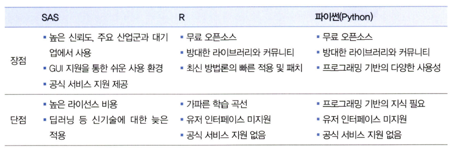
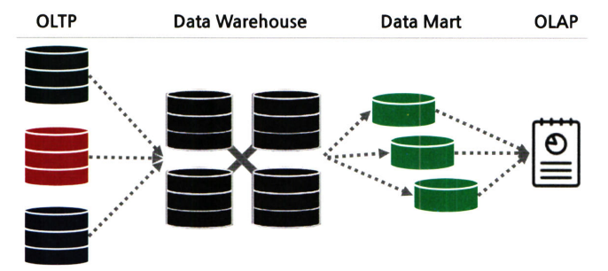
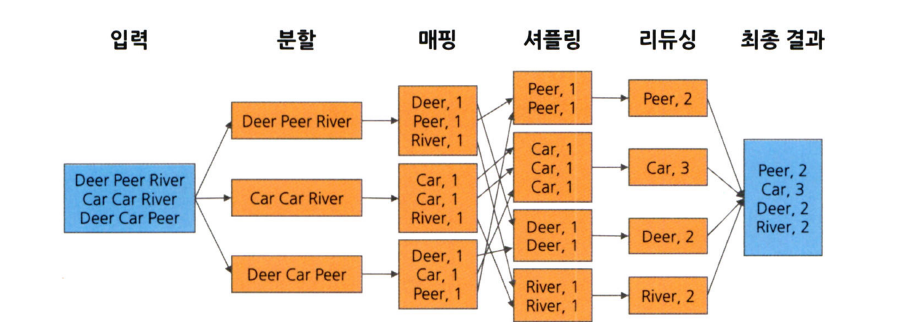
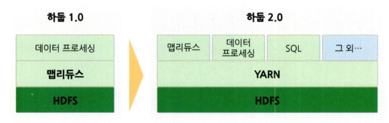
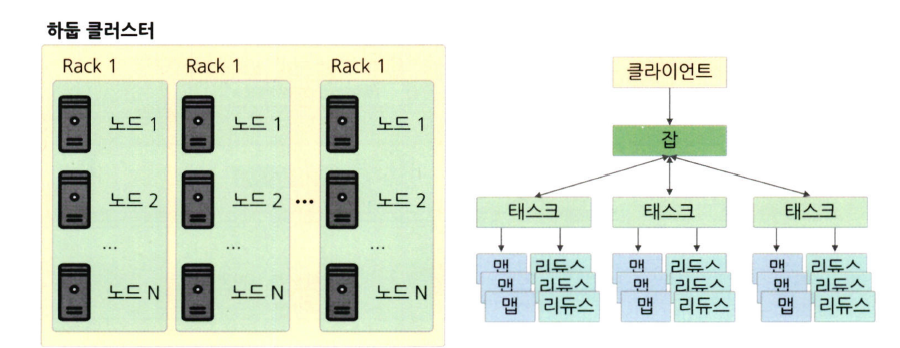
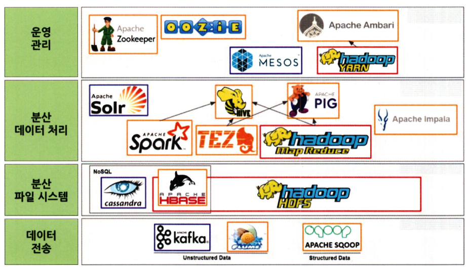
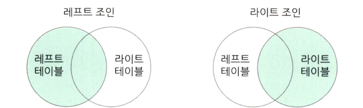
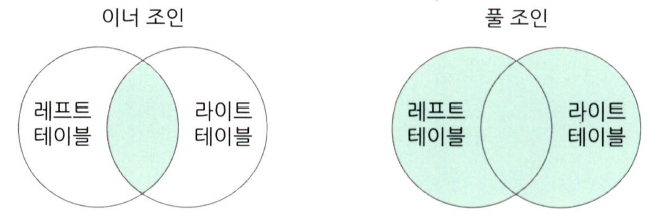
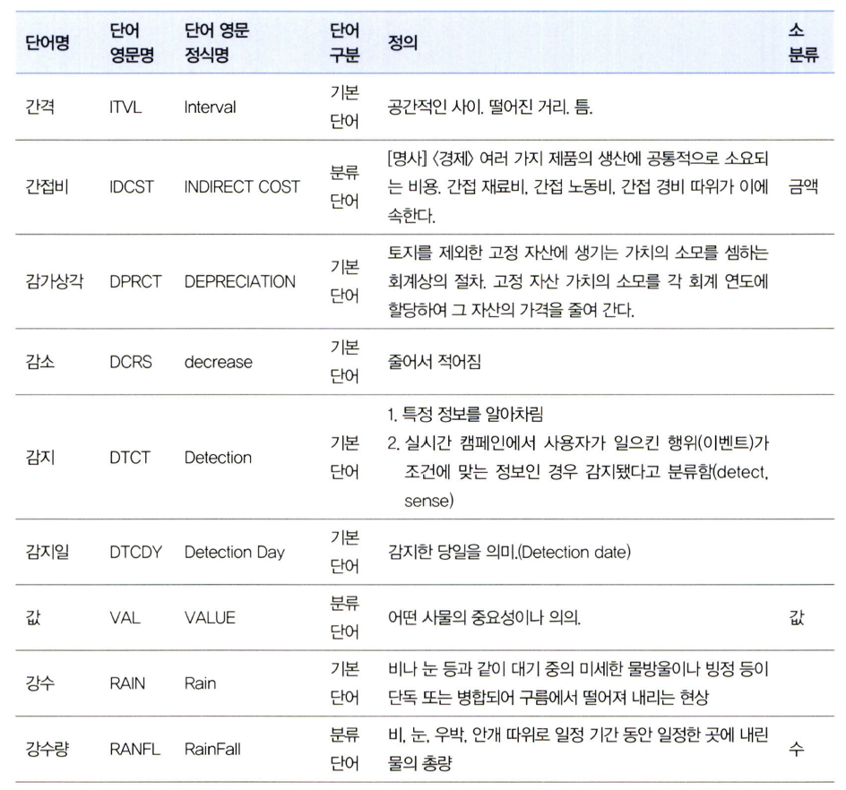

# 통계학 3주차 정규과제

📌통계학 정규과제는 매주 정해진 분량의 『*데이터 분석가가 반드시 알아야 할 모든 것*』 을 읽고 학습하는 것입니다. 이번 주는 아래의 **Statistics_3rd_TIL**에 나열된 분량을 읽고 `학습 목표`에 맞게 공부하시면 됩니다.

아래의 문제를 풀어보며 학습 내용을 점검하세요. 문제를 해결하는 과정에서 개념을 스스로 정리하고, 필요한 경우 추가자료와 교재를 다시 참고하여 보완하는 것이 좋습니다.

3주차는 `2부-데이터 분석 준비하기`를 읽고 새롭게 배운 내용을 정리해주시면 됩니다


## Statistics_3rd_TIL

### 2부. 데이터 분석 준비하기

### 08. 분석 프로젝트 준비 및 기획

### 09. 분석 환경 세팅하기


## Study ScheduleStudy Schedule

| 주차  | 공부 범위     | 완료 여부 |
| ----- | ------------- | --------- |
| 1주차 | 1부 p.2~46    | ✅         |
| 2주차 | 1부 p.47~81   | ✅         |
| 3주차 | 2부 p.82~120  | ✅         |
| 4주차 | 2부 p.121~167 | 🍽️         |
| 5주차 | 2부 p.168~202 | 🍽️         |
| 6주차 | 3부 p.203~250 | 🍽️         |
| 7주차 | 3부 p.251~299 | 🍽️         |

<!-- 여기까진 그대로 둬 주세요-->


# 1️⃣ 개념 정리 

## 08. 분석 프로젝트 준비 및 기획

```
✅ 학습 목표 :
* 데이터 분석 프로세스를 설명할 수 있다.
* 비즈니스 문제를 정의할 때 주의할 점을 설명할 수 있다.
* 외부 데이터를 수집하는 방법에 대해 인식한다.
```
<!-- 새롭게 배운 내용을 자유롭게 정리해주세요.-->

### 데이터 분석의 전체 프로세스

#### 데이터 분석의 3단계


- 데이터 분석의 목표
        의사결정 프로세스를 최적화하는 것
        효과적인 결정을 할 수 있도록 도움을 주는 것
- 설계단계
        데이터 분석에 들어가기 전에 무엇을 하고자 하는지 명확히 정의
        프로젝트 수행 인력 모집
        데이터를 관리하고 활용하는 실무자와 데이터 분석가와의 협의체계가 잘 이루어져야 함
- 분석 및 모델링 단계
        데이터 분석 및 모델링을 위한 서버 환경 마련
        데이터 분석과 모델링 수행
        데이터 추출, 검토, 가공, 모델링 등의 세부 절차와 부분 반복 필요
        모델의 비즈니스적 적합성을 분석, 성능 평가
- 구축 및 활용 단계
        최종적으로 선정된 분석 모델을 실제 업무에 적용
        성과 측정
        IT 시스템 구축
        모델 적용 후 기존보다 얼마나 개선되었는지 효과를 측정 및 평가
        A/B 테스트를 통해 모델 성과를 측정

#### CRISP-DM 방법론


- 1단계 - 비즈니스 이해
        현재 상황 평가
        데이터 마이닝 목표 결정
        프로젝트 계획 수립
- 2단계 - 데이터 이해
        데이터 설명
        데이터 탐색
        데이터 품질 확인
- 3단계 - 데이터 준비
        데이터 선택
        데이터 정제
        필수 데이터 구성
        데이터 통합
- 4단계 - 모델링
        모델링 기법 선정
        테스트 디자인 생성
        모델 생성
        모델 평가
- 5단계 - 평가
        결과 평가
        프로세스 검토
        다음 단계 설정
- 6단계 - 배포
        배포 계획
        모니터링 및 유지 관리 계획
        최종 보고서 작성
        프로젝트 검토

#### SAS SEMMA 방법론


- Sampling 단계
        전체 데이터에서 분석용 데이터 추출
        의미 있는 정보를 추출하기 위한 데이터 분할 및 병합
        표본추출을 통해 대표성을 가진 분석용 데이터 생성
        분석 모델 생성을 위한 학습, 검증, 테스트 데이터셋 분할
- Exploration 단계
        통계치 확인, 그래프 생성 등을 통해 데이터 탐색
        상관분석, 클러스터링 등을 통해 변수 간의 관계 파악
        분석 모델에 적합한 변수 선정
        데이터 현황을 파악하여 비즈니스 아이디어 도출 및 분석 방향 수정
- Modification 단계
        결측값 처리 및 최종 분석 변수 선정
        로그변환, 구간화 등 데이터 가공
        주성분분석 등을 통해 새로운 변수 생성
- Modeling 단계
        다양한 데이터마이닝 기법 적용에 대한 적합성 검토
        비즈니스 목적에 맞는 분석 모델을 선정하여 분석 알고리즘 적용
        지도학습, 비지도학습, 강화학습 등 데이터 형태에 따라 알맞은 모델 선정
        분석 환경 인프라 성능과 모델 정확도를 고려한 모델 세부 옵션 설정
- Assessment 단계
        구축한 모델들의 예측력 등 성능을 비교, 분석, 평가
        비즈니스 상황에 맞는 적정 임계치 설정
        분석 모델 결과를 비즈니스 인사이트에 적용
        상황에 따라 추가적인 데이터 분석 수행


- 다양한 방법론이 있지만 핵심은 모두 동일
- 전체 과정은 무조건 단방향으로 진행되지는 않음

### 비즈니스 문제 정의와 분석 목적 도출

#### 채찍효과
- 공급사슬(SCM)에서 수요 변동의 단계적 증폭 현상을 표현하는 용어
- 긴 채찍을 휘두르면 손잡이 부분에서 작은 흔들림만 있어도 끝부분에서는 커다란 파동이 생기는 현상
- 비즈니스 이해 및 문제 정의가 조금이라도 잘못되면 최종 인사이트 도출 및 솔루션 적용 단계에서 제대로 된 효과를 보기가 힘듦

#### MECE(Mutually Exclusive Collectively Exhaustive)


- 비즈니스 문제를 올바르게 정의하기 위한 논리적 접근법
- 가장 널리 쓰임
- 세부 정의들이 서로 겹치지 않고 전체를 합쳤을 때는 빠진 것 없이 완전히 전체를 이루는 것
- 로직 트리를 활용하여 세부 항목을 정리
- 세부 항목들은 서로 중복되지 않으면서 상위 항목 전체를 포함하고 있어야 함

#### 비즈니스 문제/목적 정의
- 비즈니스 문제는 현상에 대한 설명으로 끝나서는 안되고, 본질적인 문제점이 함께 전달되어야 함
- 분석 프로젝트의 방향이 언제든 바뀔 수 있다는 것을 염두에 두어야 함
- 분석 프로젝트를 수행하는 동안에는 실무자들 간의 커뮤니케이션 및 협력이 매우 중요함
- 도메인 지식: 해당되는 분야의 업에 대한 이해도
    - 업종 단위가 될 수도 있고 세부적으로는 하나의 조직 단위에 대한 이해도가 될 수도 있음
- 도메인 지식을 효과적으로 습득하기 위한 방법
    - 프로젝트 초반에 비즈니스 도메인에 소속된 실무자와 잦은 미팅과 함께 적극적인 질문과 자료 요청이 필요
    - 관련 논문들을 참고하여 해당 도메인에 대한 심도 있는 지식을 습득
    - 현장에 방문해 데이터가 만들어지는 과정을 직접 관찰

### 외부 데이터 수집과 크롤링
#### 외부 데이터 수집


- 정형, 반정형, 비정형 등의 다양한 유형의 데이터를 수집하는 것을 뜻함
- 외부 데이터를 수집하는 세 가지 방법
    - 데이터를 판매하는 전문 기업으로부터 필요한 데이터를 구매하거나 MOU 등을 통해 데이터를 공유하는 방법
        - 단점: 높은 비용, 복잡한 절차
        - 장점: 어느정도 정제된 고품질의 데이터를 얻을 수 있음
    - 공공 오픈 데이터를 제공하는 사이트에서 엑셀이나 csv 형태로 데이터를 받아서 활용하는 방법
        - 단점: 데이터를 원하는 형태로 가공하기 위한 리소스가 많이 들거나 활용성이 높은 데이터를 얻을 확률이 낮음
        - 장점: 데이터 수집에 특별한 비용이나 노력이 크게 들지 않음
    - 웹에 있는 데이터를 크롤링하여 수집
        - 단점: 데이터 수집을 위한 프로그래밍이 필요, 웹페이지가 리뉴얼 되면 수집 코드도 수정해야 함, 법적인 이슈 고려 필요
        - 장점: 원하는 데이터를 실시간으로 자유롭게 수집 가능

#### 크롤링
- Web 상을 돌아다니며 정보를 수집하는 것
- 크롤링: scraping(스크래핑)이라고도 부름
- HTLM 구조를 활용하여 원하는 데이터가 있는 위치를 사전에 설정하여 자동으로 반복적으로 특정 위치에 있는 텍스트를 수집하는 것
- robots.txt: 크롤링 허용 범위 안내 파일
    - User-agent: 대상 크롤러(모든 검색 봇, 구글 봇 등)
    - Allow: 허용하는 경로
    - Disallow: 허용하지 않는 경로
- 크롤링과 스크래핑의 구분
    - 크롤링: 웹 페이지가 주어지면 그 페이지 내에 있는 링크들을 따라가며 모든 내용을 전부 가져오는 것
    - 스크래핑: 웹 페이지에서 자신이 원하는 부분의 정보만 가져오는 것


## 09. 분석 환경 세팅하기

```
✅ 학습 목표 :
* 데이터 분석의 전체적인 프로세스를 설명할 수 있다.
* 테이블 조인의 개념과 종류를 이해하고, 각 조인 방식의 차이를 구분하여 설명할 수 있다.
* ERD의 개념과 역할을 이해하고, 기본 구성 요소와 관계 유형을 설명할 수 있다.
```

<!-- 새롭게 배운 내용을 자유롭게 정리해주세요.-->
### 데이터 분석 언어



#### SAS(Statistical Analysis System)
- 대표적인 제품형 데이터 분석 솔루션(프로그래미어 언어보다는 솔루션에 가까움)
- SAS Enterprise Miner이라는 GUI 기반의 데이터 마이닝 도구를 지원
- 라이선스 비용이 비싼 편
- 데이터 시각화를 쉽게 할 수 있음
- 딥러닝, 인공신경망 분석에서는 R이나 파이썬보다 약한편

#### R
- 오픈소스 데이터 분석용 언어
- 통계적 기능이 우수하며 데이터 시각화에 특화
- 10만개 이상의 데이터 분석 패키지가 공유되어 있지만 오류가 있는 패키지도 존재함

#### 파이썬
- C언어로 구현된 프로그래밍 언어
- 데이터 분석에 국한되지 않고 웹서비스, 응용 프로그램,  IoT 등 다양한 분야에서 사용됨
- Python vs C
    - 파이썬은 C에 비해 문법이 쉽고 훨씬 간단함
    - 파이썬은 C언어보다 10-350배 정도 느림
    - 딥러닝과 같이 고정적이고 복잡한 연산이 많이 필요한 경우 부분적으로 C언어를 활용하여 분석 성능을 높이기도 함
- 10만개 이상의 패키지가 존재
- 대표적인 패키지
    - 기계학습 도구: sklearn, TensorFlow
    - 데이터 분석용 도구: Pandas, NumPy, matplotlib

#### SQL(Structured Query Language)
- 관계형 데이터베이스 시스템에서 데이터를 관리 및 처리하기 위해 설계된 언어
- 대화식 언어이기 때문에 명령문이 짧고 간결

### 데이터 처리 프로세스



일반적으로 전체적인 데이터 흐름은 OLTP->DW(ODS)->DM->OLAP으로 이루어짐

#### OLTP(On-Line Transaction Processing)
- 실시간으로 데이터를 트랜잭션 단위로 수집, 분류, 저장하는 시스템
- 데이터가 생성되고 저장되는 처음 단계

#### DW(Data Warehouse)
- 데이터 장고와 같은 개념
- 수집된 데이터를 사용자 관점에서 주제별로 통합하여 쉽게 원하는 데이터를 빼낼 수 있도록 저장해놓은 통합 데이터베이스
- 여러 시스템에 산재되어 있던 데이터들을 한 곳으로 취합하여 모아 놓는 저장소
- DW를 통해 OLTP를 보호하고 데이터 활용 효율을 높일 수 있음
- ODS(Operational Data Store)
    - 데이터를 DW에 저장하기 전에 임시로 데이터를 보관하는 중간 단계의 저장소
    - DW가 전체 히스토리 데이터를 보관하는 반면 ODS는 최신 데이터를 반영하는 것에 목적이 있음

#### DM(Data Mart)
- 사용자의 목적에 맞도록 가공된 일부의 데이터가 저장되는 곳
- 접근성과 데이터 분석의 효율성을 높일 수 있으며, DW의 시스템 부하를 감소시킬 수 있음
- ELT
    - 저장된 데이터의 처리 프로세스에 대한 가장 기본적인 개념
    - 데이터 추출(Extract), 변환(Transform), 불러내기(Load)의 준말
    - 저장된 데이터를 사용자가 요구하는 포맷으로 변형하여 이동시키는 작업 과정
        - Extract: 원천 소스 데이터베이스로부터 필요한 데이터를 읽어 들이는 과정
        - Transform: 미변환 상태의 raw 데이터를 정리, 필터링, 정형화하고 요약하여 분석에 적합한 상태로 바꾸어 놓는 과정
        - Load: 변환된 데이터를 새로운 테이블에 적재하는 과정

### 분산데이터 처리

컴퓨터가 처리해야 할 일을 여러 컴퓨터가 나눠서 한 다음 그 결과를 합치는 것
- scale-up 방식: 빅데이터를 처리하기 위해 하나의 컴퓨터의 용량을 늘리고 더 빠른 프로세서를 탑재하는 것, 데이터의 크기가 커지면 속도가 급격히 느려짐
- scale-out 방식: 분산데이터 처리처럼 여러 대의 컴퓨터를 병렬적으로 연결하는 것, 효율이 훨씬 음

#### HDFS(Hadoop Distributed File System)
- Slave node, Master node, Client machines의 세 가지 모듈로 나뉨
    - Slave node: 데이터를 저장하고 계산하는 세부적인 역할 수행
    - Master node: 대량의 데이터를 HDFS에 저장하고 맵리듀스 방식을 통해 데이터를 병렬 처리
    - Client machines: 맵리듀스 작업을 통해 산출된 결과를 사용자에게 보여줌
- 맵리듀스(Mapreduce)
    - HDFS에 저장된 데이터를 효과적으로 처리하는 방법
    - 맵리듀스는 크게 Map과 Reduce의 두 단계로 구성됨
        - Map: 흩어져 있는 데이터를 관련 데이터끼리 묶어서 임시의 집합을 만드는 과정
        - Reduce: 필터링과 정렬을 거쳐 데이터를 뽑아냄
    - 맵리듀스의 중요한 특징은 key-value 쌍으로 데이터를 처리한다는 것
    - 맵리듀스가 단어의 수를 세는 네가지 단계
        
        
        

        - 분할: 입력된 데이터를 고정된 크기의 조각으로 분할
        - 매핑: 분할된 데이터를 key-value 형태로 묶어주고 단어 게수를 계산
        - 셔플링: 매핑 단계의 counting 결과를 정렬 및 병합
        - 리듀싱: 각 결과를 취합 및 계산하여 최종 결괏값을 산출
- 하둡
        
    

    - 제공되는 기능에 따라 하둡1.0과 하둡2.0으로 구분됨
    - JobTracker(하둡1.0): 기본적인 리소스 관리 시스템
        - 전체 클러스터의 리소스 관리
        - 수행 중인 잡들의 진행상황, 에러 관리
        - 완료된 잡들의 로그 저장 및 확인
    - YARN(하둡2.0)
        - JobTracker를 리스소 매니저와 애플리케이션 마스터 그리고 타임라인 서버 등으로 분리하여 기능을 고도화함
        - 각 클러스터마다 애플리케이션 마스터가 존재하여 여러 잡들이 성공적으로 실행될 수 있도록 리소스 관리와 스케줄링, 모니터링 기능 등을 제공
        - 잡에 필요한 자원은 리소스 매니저를 통해 할당받음
        - 잡에 대한 로그 이력 관리는 타임라인 서버를 통해 함
        - Node Manager 기능도 제공되는데, 이는 모든 노드에서 실행되어 각각의 할당된 task를 실행하고 진행 상황을 관리함

- 분산 시스템 구조
    
    
    
    노드는 하나의 컴퓨터, 몇 개의 컴퓨터가 모인 것이 랙(rack), 랙들이 모인 것이 클러스터
    클라이언트가 하나의 잡을 실행시키면 그 잡은 여러 개의 태스크를 실행하게 되고 각각의 태스크는 맵과 리듀스를 통해 분산처리

#### 아파치 스파크
##### HDFS와 스파크


- HDFS는 데이터 전송, 분산 파일 시스템, 분산 데이터 처리, 운영 관리 레이어로 구분되는데, 스파크는 이 중에서 분산 데이터 처리를 하는 하나의 시스템
- 스파크의 특징
    - 인메모리 기반의 빠른 데이터 처리 가능
    - Java, Scala, 파이썬, R, SQL 등 다양한 언어를 지원
    - 맵리듀스와 비슷한 일괄 처리 기능과 실시간 데이터 처리, 다양한 머신러닝 알고리즘과 시각화 알고리즘을 단일 프레임워크로 통합시킴
    - OLAP 작업에 특화
    - OLTP와 같은 대량의 원자성 트랜잭션 처리에는 적합하지 않음
- 제플린(Zeppelin)
    - 순수한 파이썬 언어로도 데이터 가공과 모델링 가능
    - 스파크의 병렬처리를 효과적으로 하기 위해 PySpark, Spark SQL 등을 사용할 수 있음

### 테이블 조인과 정의서, 그리고 ERD

#### 테이블 조인
- 조인: 2개 이상의 테이블을 공통의 칼럼을 중심으로 결합하는 것으로 이너 조인, 아우터 조인, 레프트 조인, 라이트 조인, 풀 조인, 크로스 조인 등이 있음
##### 레프트 조인과 라이트 조인


- 하나의 테이블을 기준으로 다른 테이블에서 겹치는 부분을 결합
- 기준이 되는 테이블의 데이터는 그대로 유지하면서 조인하는 테이블의 데이터만 추가됨
- 일치하는 키 값이 없는 행은 조인하는 테이블의 값이 결측값으로 나타남
- 결합하는 테이블의 키 값에 해당하는 관측치가 여러 개면 그만큼 행이 늘어남

##### 이너 조인과 풀 조인


- 이너 조인: 두 테이블 간에 겹치는 부분의 행만 가져오는 조인 방법
- 풀 조인: 모든 행을 살리는 조인 방법, 조인되지 않은 부분은 결측값이 됨

##### 크로스 조인
- 값이 없더라도 모든 행이 생기도록 데이터 가공을 해야 할 때 사용
- 주로 머신러닝에 사용되는 데이터셋을 생성할 때 사용
- 사용되는 경우가 드물음

#### 데이터 단어사전



- 각 칼럼과 테이블의 이름을 정할 때 체계를 약속한 일종의 사전
- 메타데이터 관리 시스템: 데이터가 어디에 어떻게 저장되어 있는지, 그리고 데이터를 어떻게 사용할 것인지 이해할 수 있도록 데이터에 대한 정보를 관리하는 시스템

#### 테이블 정의서
- 각 DW, DM 등에 적재된 테이블과 칼럼의 한글과 영문명, 데이터 속성, 그리고 간단한 설명 등이 정리된 표
- 일반적으로 엑셀 파일로 만들어 곧바로 원하는 정보를 찾아보기 위해 사용

#### ERD(Entity Relationship Diagram)
- 각 테이블의 구성 정보와 테이블 간 관계를 도식으로 표현한 그림 형태로 구성됨
- 처음 프로젝트에 투입됐을 때 데이터 환경을 파악하기 위해 ERD를 확인
- ERWin이라는 프로그램을 많이 사용
- 테이블은 Entity(엔티티)라고 불리며 각 테이블이 어떤 테이블과 어떤 키로 연결되어 있는지 직관적으로 확인 가능
##### 물리
- 영문으로 되어있음
- DB를 효율적이고 결점 없이 구현하는 것을 목표로 구현하는 ERD 개념
##### 논리
- 한글로 되어있음
- 데이터 사용자 입장에서 테이블 간 매칭에 오류가 없으며 데이터의 정규화가 이루어진 ERD 개념
- 논리 ERD를 보고 DB 구조 파악
##### ERD의 핵심
- 테이블 간 연결을 해주는 키 칼럼과 연결 관계를 의미하는 식별자
- 키 칼럼은 ID와 같은 개념, 기본 키와 외래 키로 구분됨
    - 기본 키: 테이블에 적재된 각각의 데이터를 유일하게 구분하는 키
        - 중복될 수 없으며 결측값을 가질 수 없다
    - 외래 키: 각 테이블 간에 연결을 만들기 위해 테이블에서 다른 테이블의 참조되는 기본 키
        - 중복이나 결측값이 있을 수 있음
        - 외래 키가 정의된 테이블은 자식테이블, 참조되는 테이블은 부모테이블이라 부름
    - 슈퍼 키: 위 테이블 외에 테이블에서 각 행을 유일하게 식별할 수 있는 하나의 키 혹은 조합된 키
    - 후보 키: 기본 키의 조건인 유일성과 최소성을 만족하지만 기본 키는 아닌 후보 키
    - 테이블 간에는 1:1로 매칭되는 경우도 있고 1:N, N:N 등으로 연결된 경우도 많기 때문에 이러한 관계를 정확히 파악하고 데이터를 다뤄야 함
        
<br>
<br>

---

# 2️⃣ 확인 문제

## 문제 1.

> **🧚 아래의 테이블을 조인한 결과를 출력하였습니다. 어떤 조인 방식을 사용했는지 맞춰보세요.**

> 사용한 테이블은 다음과 같습니다.

| **emp_cd** | **emp_nm** | **job** | **dep_cd** |
| ---------- | ---------- | ------- | ---------- |
| 1001       | 김권택     | 부장    | 30         |
| 1002       | 김미정     | 과장    | 20         |
| 1003       | 이지민     | 대리    | 20         |
| 1004       | 장동혁     | 사원    | 10         |
| 1005       | 이승화     | 사원    | 30         |
| 1006       | 곽주영     | 과장    | 40         |
| 1007       | 조용호     | 사장    | NULL       |
| 1008       | 가나다     | 대리    | 40         |
| 1009       | 홍길동     | 차장    | 10         |

| **dep_cd** | **dep_nm** | **location** |
| ---------- | ---------- | ------------ |
| 10         | 인사팀     | 서울         |
| 20         | 경리팀     | 서울         |
| 30         | 영업팀     | 과천         |
| 40         | 전산팀     | 대전         |
| 50         | 법무팀     | 인천         |

> 보기: INNER, LEFT, RIGHT 조인

<!-- 테이블 조인의 종류를 이해하였는지 확인하기 위한 문제입니다. 각 테이블이 어떤 조인 방식을 이용하였을지 고민해보고 각 테이블 아래에 답을 작성해주세요.-->

### 1-1. 

| **emp_cd** | **emp_nm** | **job** | **dep_cd** | **dep_nm** | **location** |
| ---------- | ---------- | ------- | ---------- | ---------- | ------------ |
| 1001       | 김권택     | 부장    | 30         | 영업팀     | 과천         |
| 1002       | 김미정     | 과장    | 20         | 경리팀     | 서울         |
| 1003       | 이지민     | 대리    | 20         | 경리팀     | 서울         |
| 1004       | 장동혁     | 사원    | 10         | 인사팀     | 서울         |
| 1005       | 이승화     | 사원    | 30         | 영업팀     | 과천         |
| 1006       | 곽주영     | 과장    | 40         | 전산팀     | 대전         |
| 1007       | 김태연     | 사장    |            |            |              |
| 1008       | 최철원     | 대리    | 40         | 전산팀     | 대전         |
| 1009       | 노동희     | 차장    | 10         | 인사팀     | 서울         |

```
LEFT 조인
```


### 1-2. 

| **emp_cd** | **emp_nm** | **job** | **dep_cd** | **dep_nm** | **location** |
| ---------- | ---------- | ------- | ---------- | ---------- | ------------ |
| 1001       | 김권택     | 부장    | 30         | 영업팀     | 과천         |
| 1002       | 김미정     | 과장    | 20         | 경리팀     | 서울         |
| 1003       | 이지민     | 대리    | 20         | 경리팀     | 서울         |
| 1004       | 장동혁     | 사원    | 10         | 인사팀     | 서울         |
| 1005       | 이승화     | 사원    | 30         | 영업팀     | 과천         |
| 1006       | 곽주영     | 과장    | 40         | 전산팀     | 대전         |
| 1008       | 최철원     | 대리    | 40         | 전산팀     | 대전         |
| 1009       | 노동희     | 차장    | 10         | 인사팀     | 서울         |

```
INNER 조인
```


### 1-3. 

| **emp_cd** | **emp_nm** | **job** | **dep_cd** | **dep_nm** | **location** |
| ---------- | ---------- | ------- | ---------- | ---------- | ------------ |
| 1004       | 장동혁     | 사원    | 10         | 인사팀     | 서울         |
| 1009       | 홍길동     | 차장    | 10         | 인사팀     | 서울         |
| 1002       | 김미정     | 과장    | 20         | 경리팀     | 서울         |
| 1003       | 이지민     | 대리    | 20         | 경리팀     | 서울         |
| 1001       | 김권택     | 부장    | 30         | 영업팀     | 과천         |
| 1005       | 이승화     | 사원    | 30         | 영업팀     | 과천         |
| 1006       | 곽주영     | 과장    | 40         | 전산팀     | 대전         |
| 1008       | 최철원     | 대리    | 40         | 전산팀     | 대전         |
|            |            |         | 50         | 법무팀     | 인천         |

```
RIGHT 조인
```


### 🎉 수고하셨습니다.
