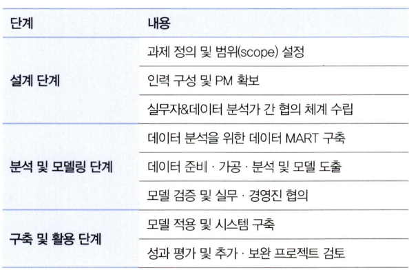
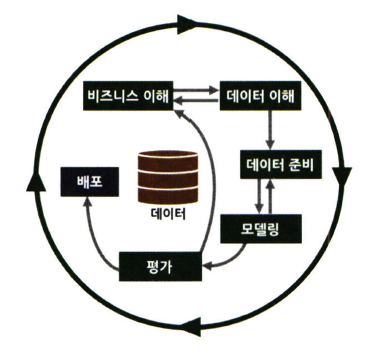
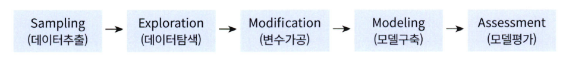
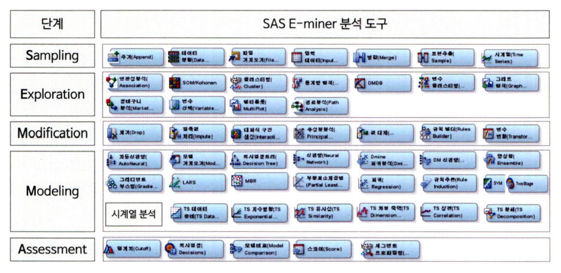
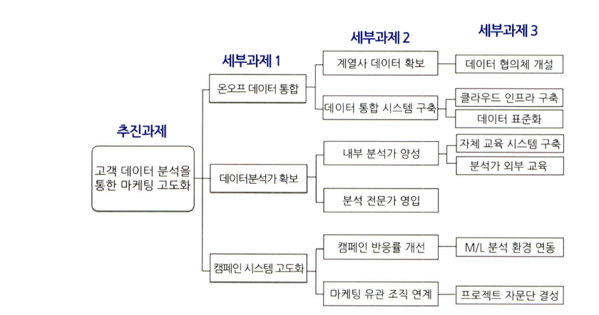
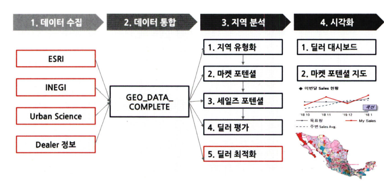

# 통계학 3주차 정규과제

📌통계학 정규과제는 매주 정해진 분량의 『*데이터 분석가가 반드시 알아야 할 모든 것*』 을 읽고 학습하는 것입니다. 이번 주는 아래의 **Statistics_3rd_TIL**에 나열된 분량을 읽고 `학습 목표`에 맞게 공부하시면 됩니다.

아래의 문제를 풀어보며 학습 내용을 점검하세요. 문제를 해결하는 과정에서 개념을 스스로 정리하고, 필요한 경우 추가자료와 교재를 다시 참고하여 보완하는 것이 좋습니다.

3주차는 `2부-데이터 분석 준비하기`를 읽고 새롭게 배운 내용을 정리해주시면 됩니다


## Statistics_3rd_TIL

### 2부. 데이터 분석 준비하기

### 08. 분석 프로젝트 준비 및 기획

### 09. 분석 환경 세팅하기


## Study ScheduleStudy Schedule

| 주차  | 공부 범위     | 완료 여부 |
| ----- | ------------- | --------- |
| 1주차 | 1부 p.2~46    | ✅         |
| 2주차 | 1부 p.47~81   | ✅         |
| 3주차 | 2부 p.82~120  | ✅         |
| 4주차 | 2부 p.121~167 | 🍽️         |
| 5주차 | 2부 p.168~202 | 🍽️         |
| 6주차 | 3부 p.203~250 | 🍽️         |
| 7주차 | 3부 p.251~299 | 🍽️         |

<!-- 여기까진 그대로 둬 주세요-->


# 1️⃣ 개념 정리 

## 08. 분석 프로젝트 준비 및 기획

```
✅ 학습 목표 :
* 데이터 분석 프로세스를 설명할 수 있다.
* 비즈니스 문제를 정의할 때 주의할 점을 설명할 수 있다.
* 외부 데이터를 수집하는 방법에 대해 인식한다.
```
<!-- 새롭게 배운 내용을 자유롭게 정리해주세요.-->

### 데이터 분석의 전체 프로세스

#### 데이터 분석의 3단계
<p align="center">

</p>
- 데이터 분석의 목표
        의사결정 프로세스를 최적화하는 것
        효과적인 결정을 할 수 있도록 도움을 주는 것
- 설계단계
        데이터 분석에 들어가기 전에 무엇을 하고자 하는지 명확히 정의
        프로젝트 수행 인력 모집
        데이터를 관리하고 활용하는 실무자와 데이터 분석가와의 협의체계가 잘 이루어져야 함
- 분석 및 모델링 단계
        데이터 분석 및 모델링을 위한 서버 환경 마련
        데이터 분석과 모델링 수행
        데이터 추출, 검토, 가공, 모델링 등의 세부 절차와 부분 반복 필요
        모델의 비즈니스적 적합성을 분석, 성능 평가
- 구축 및 활용 단계
        최종적으로 선정된 분석 모델을 실제 업무에 적용
        성과 측정
        IT 시스템 구축
        모델 적용 후 기존보다 얼마나 개선되었는지 효과를 측정 및 평가
        A/B 테스트를 통해 모델 성과를 측정

#### CRISP-DM 방법론

<p align="center">

</p>

- 1단계 - 비즈니스 이해
        현재 상황 평가
        데이터 마이닝 목표 결정
        프로젝트 계획 수립
- 2단계 - 데이터 이해
        데이터 설명
        데이터 탐색
        데이터 품질 확인
- 3단계 - 데이터 준비
        데이터 선택
        데이터 정제
        필수 데이터 구성
        데이터 통합
- 4단계 - 모델링
        모델링 기법 선정
        테스트 디자인 생성
        모델 생성
        모델 평가
- 5단계 - 평가
        결과 평가
        프로세스 검토
        다음 단계 설정
- 6단계 - 배포
        배포 계획
        모니터링 및 유지 관리 계획
        최종 보고서 작성
        프로젝트 검토

#### SAS SEMMA 방법론

<p align="center">

</p>

- Sampling 단계
        전체 데이터에서 분석용 데이터 추출
        의미 있는 정보를 추출하기 위한 데이터 분할 및 병합
        표본추출을 통해 대표성을 가진 분석용 데이터 생성
        분석 모델 생성을 위한 학습, 검증, 테스트 데이터셋 분할
- Exploration 단계
        통계치 확인, 그래프 생성 등을 통해 데이터 탐색
        상관분석, 클러스터링 등을 통해 변수 간의 관계 파악
        분석 모델에 적합한 변수 선정
        데이터 현황을 파악하여 비즈니스 아이디어 도출 및 분석 방향 수정
- Modification 단계
        결측값 처리 및 최종 분석 변수 선정
        로그변환, 구간화 등 데이터 가공
        주성분분석 등을 통해 새로운 변수 생성
- Modeling 단계
        다양한 데이터마이닝 기법 적용에 대한 적합성 검토
        비즈니스 목적에 맞는 분석 모델을 선정하여 분석 알고리즘 적용
        지도학습, 비지도학습, 강화학습 등 데이터 형태에 따라 알맞은 모델 선정
        분석 환경 인프라 성능과 모델 정확도를 고려한 모델 세부 옵션 설정
- Assessment 단계
        구축한 모델들의 예측력 등 성능을 비교, 분석, 평가
        비즈니스 상황에 맞는 적정 임계치 설정
        분석 모델 결과를 비즈니스 인사이트에 적용
        상황에 따라 추가적인 데이터 분석 수행

<p align="center">

</p>

- 다양한 방법론이 있지만 핵심은 모두 동일
- 전체 과정은 무조건 단방향으로 진행되지는 않음

### 비즈니스 문제 정의와 분석 목적 도출

#### 채찍효과
- 공급사슬(SCM)에서 수요 변동의 단계적 증폭 현상을 표현하는 용어
- 긴 채찍을 휘두르면 손잡이 부분에서 작은 흔들림만 있어도 끝부분에서는 커다란 파동이 생기는 현상
- 비즈니스 이해 및 문제 정의가 조금이라도 잘못되면 최종 인사이트 도출 및 솔루션 적용 단계에서 제대로 된 효과를 보기가 힘듦

#### MECE
- 비즈니스 문제를 올바르게 정의하기 위한 논리적 접근법
- 가장 널리 쓰임
- Mutually Exclusive Collectively Exhaustive
- 세부 정의들이 서로 겹치지 않고 전체를 합쳤을 때는 빠진 것 없이 완전히 전체를 이루는 것
- 로직 트리를 활용하여 세부 항목을 정리
- 세부 항목들은 서로 중복되지 않으면서 상위 항목 전체를 포함하고 있어야 함

<p align="center">

</p>

#### 비즈니스 문제/목적 정의
- 비즈니스 문제는 현상에 대한 설명으로 끝나서는 안되고, 본질적인 문제점이 함께 전달되어야 함
- 분석 프로젝트의 방향이 언제든 바뀔 수 있다는 것을 염두에 두어야 함
- 분석 프로젝트를 수행하는 동안에는 실무자들 간의 커뮤니케이션 및 협력이 매우 중요함
- 도메인 지식: 해당되는 분야의 업에 대한 이해도
    - 업종 단위가 될 수도 있고 세부적으로는 하나의 조직 단위에 대한 이해도가 될 수도 있음
- 도메인 지식을 효과적으로 습득하기 위한 방법
    - 프로젝트 초반에 비즈니스 도메인에 소속된 실무자와 잦은 미팅과 함께 적극적인 질문과 자료 요청이 필요
    - 관련 논문들을 참고하여 해당 도메인에 대한 심도 있는 지식을 습득
    - 현장에 방문해 데이터가 만들어지는 과정을 직접 관찰

### 외부 데이터 수집과 크롤링
#### 외부 데이터 수집

<p align="center">

</p>

- 정형, 반정형, 비정형 등의 다양한 유형의 데이터를 수집하는 것을 뜻함
- 외부 데이터를 수집하는 세 가지 방법
    - 데이터를 판매하는 전문 기업으로부터 필요한 데이터를 구매하거나 MOU 등을 통해 데이터를 공유하는 방법
        - 단점: 높은 비용, 복잡한 절차
        - 장점: 어느정도 정제된 고품질의 데이터를 얻을 수 있음
    - 공공 오픈 데이터를 제공하는 사이트에서 엑셀이나 csv 형태로 데이터를 받아서 활용하는 방법
        - 단점: 데이터를 원하는 형태로 가공하기 위한 리소스가 많이 들거나 활용성이 높은 데이터를 얻을 확률이 낮음
        - 장점: 데이터 수집에 특별한 비용이나 노력이 크게 들지 않음
    - 웹에 있는 데이터를 크롤링하여 수집
        - 단점: 데이터 수집을 위한 프로그래밍이 필요, 웹페이지가 리뉴얼 되면 수집 코드도 수정해야 함, 법적인 이슈 고려 필요
        - 장점: 원하는 데이터를 실시간으로 자유롭게 수집 가능

#### 크롤링
- Web 상을 돌아다니며 정보를 수집하는 것
- 크롤링: scraping(스크래핑)이라고도 부름
- robots.txt: 클롤링 허용 범위 안내 파일
    - User-agent: 대상 크롤러(모든 검색 봇, 구글 봇 등)
    - Allow: 허용하는 경로
    - Disallow: 허용하지 않는 경로
- 크롤링과 스크래핑의 구분
    - 크롤링: 웹 페이지가 주어지면 그 페이지 내에 있는 링크들을 따라가며 모든 내용을 전부 가져오는 것
    - 스크래핑: 웹 페이지에서 자신이 원하는 부분의 정보만 가져오는 것


## 09. 분석 환경 세팅하기

```
✅ 학습 목표 :
* 데이터 분석의 전체적인 프로세스를 설명할 수 있다.
* 테이블 조인의 개념과 종류를 이해하고, 각 조인 방식의 차이를 구분하여 설명할 수 있다.
* ERD의 개념과 역할을 이해하고, 기본 구성 요소와 관계 유형을 설명할 수 있다.
```

<!-- 새롭게 배운 내용을 자유롭게 정리해주세요.-->


<br>
<br>

---

# 2️⃣ 확인 문제

## 문제 1.

> **🧚 아래의 테이블을 조인한 결과를 출력하였습니다. 어떤 조인 방식을 사용했는지 맞춰보세요.**

> 사용한 테이블은 다음과 같습니다.

| **emp_cd** | **emp_nm** | **job** | **dep_cd** |
| ---------- | ---------- | ------- | ---------- |
| 1001       | 김권택     | 부장    | 30         |
| 1002       | 김미정     | 과장    | 20         |
| 1003       | 이지민     | 대리    | 20         |
| 1004       | 장동혁     | 사원    | 10         |
| 1005       | 이승화     | 사원    | 30         |
| 1006       | 곽주영     | 과장    | 40         |
| 1007       | 조용호     | 사장    | NULL       |
| 1008       | 가나다     | 대리    | 40         |
| 1009       | 홍길동     | 차장    | 10         |

| **dep_cd** | **dep_nm** | **location** |
| ---------- | ---------- | ------------ |
| 10         | 인사팀     | 서울         |
| 20         | 경리팀     | 서울         |
| 30         | 영업팀     | 과천         |
| 40         | 전산팀     | 대전         |
| 50         | 법무팀     | 인천         |

> 보기: INNER, LEFT, RIGHT 조인

<!-- 테이블 조인의 종류를 이해하였는지 확인하기 위한 문제입니다. 각 테이블이 어떤 조인 방식을 이용하였을지 고민해보고 각 테이블 아래에 답을 작성해주세요.-->

### 1-1. 

| **emp_cd** | **emp_nm** | **job** | **dep_cd** | **dep_nm** | **location** |
| ---------- | ---------- | ------- | ---------- | ---------- | ------------ |
| 1001       | 김권택     | 부장    | 30         | 영업팀     | 과천         |
| 1002       | 김미정     | 과장    | 20         | 경리팀     | 서울         |
| 1003       | 이지민     | 대리    | 20         | 경리팀     | 서울         |
| 1004       | 장동혁     | 사원    | 10         | 인사팀     | 서울         |
| 1005       | 이승화     | 사원    | 30         | 영업팀     | 과천         |
| 1006       | 곽주영     | 과장    | 40         | 전산팀     | 대전         |
| 1007       | 김태연     | 사장    |            |            |              |
| 1008       | 최철원     | 대리    | 40         | 전산팀     | 대전         |
| 1009       | 노동희     | 차장    | 10         | 인사팀     | 서울         |

```
여기에 답을 작성해주세요!
```


### 1-2. 

| **emp_cd** | **emp_nm** | **job** | **dep_cd** | **dep_nm** | **location** |
| ---------- | ---------- | ------- | ---------- | ---------- | ------------ |
| 1001       | 김권택     | 부장    | 30         | 영업팀     | 과천         |
| 1002       | 김미정     | 과장    | 20         | 경리팀     | 서울         |
| 1003       | 이지민     | 대리    | 20         | 경리팀     | 서울         |
| 1004       | 장동혁     | 사원    | 10         | 인사팀     | 서울         |
| 1005       | 이승화     | 사원    | 30         | 영업팀     | 과천         |
| 1006       | 곽주영     | 과장    | 40         | 전산팀     | 대전         |
| 1008       | 최철원     | 대리    | 40         | 전산팀     | 대전         |
| 1009       | 노동희     | 차장    | 10         | 인사팀     | 서울         |

```
여기에 답을 작성해주세요!
```


### 1-3. 

| **emp_cd** | **emp_nm** | **job** | **dep_cd** | **dep_nm** | **location** |
| ---------- | ---------- | ------- | ---------- | ---------- | ------------ |
| 1004       | 장동혁     | 사원    | 10         | 인사팀     | 서울         |
| 1009       | 홍길동     | 차장    | 10         | 인사팀     | 서울         |
| 1002       | 김미정     | 과장    | 20         | 경리팀     | 서울         |
| 1003       | 이지민     | 대리    | 20         | 경리팀     | 서울         |
| 1001       | 김권택     | 부장    | 30         | 영업팀     | 과천         |
| 1005       | 이승화     | 사원    | 30         | 영업팀     | 과천         |
| 1006       | 곽주영     | 과장    | 40         | 전산팀     | 대전         |
| 1008       | 최철원     | 대리    | 40         | 전산팀     | 대전         |
|            |            |         | 50         | 법무팀     | 인천         |

```
여기에 답을 작성해주세요!
```


### 🎉 수고하셨습니다.
