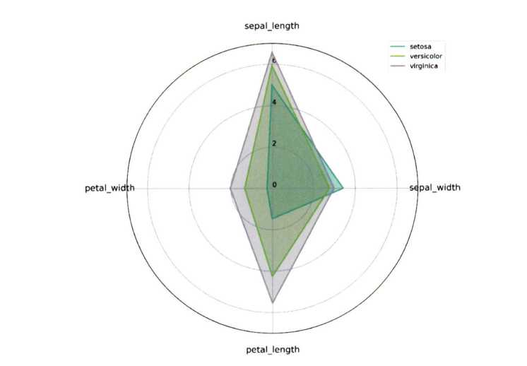

# 통계학 4주차 정규과제

📌통계학 정규과제는 매주 정해진 분량의 『*데이터 분석가가 반드시 알아야 할 모든 것*』 을 읽고 학습하는 것입니다. 이번 주는 아래의 **Statistics_4th_TIL**에 나열된 분량을 읽고 `학습 목표`에 맞게 공부하시면 됩니다.

아래의 문제를 풀어보며 학습 내용을 점검하세요. 문제를 해결하는 과정에서 개념을 스스로 정리하고, 필요한 경우 추가자료와 교재를 다시 참고하여 보완하는 것이 좋습니다.

4주차는 `2부-데이터 분석 준비하기`를 읽고 새롭게 배운 내용을 정리해주시면 됩니다


## Statistics_4th_TIL

### 2부. 데이터 분석 준비하기

### 10. 데이터 탐색과 시각화

<!-- 10. 데이터 탐색과 시각화에서 10.1 탐색적 데이터 분석부터 10.4 비교 시각화 파트까지 진행해주시면 됩니다. -->


**(수행 인증샷은 필수입니다.)** 

<!-- 이번주는 확인 문제가 없고, 교재의 실습에 있는 부분을 따라해주시면 됩니다. 데이터셋과 참고자료는 노션의 정규과제란에 있는 깃허브를 활용해주시면 됩니다. -->


## Study ScheduleStudy Schedule

| 주차  | 공부 범위     | 완료 여부 |
| ----- | ------------- | --------- |
| 1주차 | 1부 p.2~46    | ✅         |
| 2주차 | 1부 p.47~81   | ✅         |
| 3주차 | 2부 p.82~120  | ✅         |
| 4주차 | 2부 p.121~167 | ✅         |
| 5주차 | 2부 p.168~202 | 🍽️         |
| 6주차 | 3부 p.203~250 | 🍽️         |
| 7주차 | 3부 p.251~299 | 🍽️         |

<!-- 여기까진 그대로 둬 주세요-->


---

# 1️⃣ 개념 정리 

## 10. 데이터 탐색과 시각화

```
✅ 학습 목표 :
* EDA의 목적을 설명할 수 있다.
* 주어진 데이터셋에서 이상치, 누락값, 분포 등을 식별하고 EDA 결과를 바탕으로 데이터셋의 특징을 해석할 수 있다.
* 공분산과 상관계수를 활용하여 두 변수 간의 관계를 해석할 수 있다.
* 적절한 시각화 기법을 선택하여 데이터의 특성을 효과적으로 전달할 수 있다.
```

<!-- 새롭게 배운 내용을 자유롭게 정리해주세요.-->

EDA와 데이터 시각화는 구별해서 생각해야 할 필요가 있음<br>
데이터 시각화의 궁극적 목적은 분석 결과를 커뮤니케이션 하기 위함임

### 탐색적 데이터 분석(EDA)
- EDA를 할 때는 극단적인 해석은 피해야 하며 지나친 추론이나 자의적 해석도 지양해야 함

#### EDA의 주요 목적
- 데이터의 형태와 척도가 분석에 알맞게 되어있는지 확인(sanity checking)
- 데이터의 평균, 분산, 분포, 패턴 등의 확인을 통해 데이터 특성 파악
- 데이터의 결측값이나 이상치 파악 및 보완
- 변수 간의 관계성 파악
- 분석 목적과 방향성 점검 및 보정

#### 엑셀을 활용한 EDA
샘플 데이터 예시


컬럼별 기본 정보 예시


- EDA를 하는 가장 간단하면서 효과적인 방법: 각 데이터 샘플을 1000개씩 뽑아서 엑셀에 붙여 놓고 변수와 설명 리스트와 함께 눈으로 쭉 살펴보는 것
- Pivot 테이블을 생성해서 지점별 성비, 고객 등급별 평균 판매가격 등을 확인할 수 있음
- 필요에 따라서는 간단한 그래프를 그려 직관적으로 데이터를 파악할 수 있음
- Python, R, SAS 등의 프로그램들의 데이터 가공 및 시각화 기능이 아무리 좋다 해도 적은 데이터를 다룰 때는 엑셀이 가장 사용자 친화적 및 효율적임

#### 탐색적 데이터 분석 실습
~~~
1. 데이터 파악
    head(): 데이터가 제대로 로드 됐는지 확인
    info(): 데이터에 대한 전반적인 정보를 나타냄
    describe(): 평균, 표준편차, 최대/최솟값 등을 한 번에 확인
    skew(): 각 컬럼의 왜도 확인
    kurtosis(): 각 컬럼의 첨도 확인

2. Seaborn을 활용한 시각화
    sns.displot(): 확인하고자 하는 컬럼의 분포를 시각화
    sns.violinplot(): 분포를 효과적으로 표현
    sns.stripplot(): 각 관측치의 위치를 직관적으로 표현
~~~

### 공분산과 상관성 분석
데이터 탐색 과정에서 평균, 분산, 왜도, 첨도, 결측치 등 각 변수들의 특성을 파악한 후 변수간의 관계 또한 파악해야 함<br>
타깃변수 Y와 입력변수 X와의 관계는 물론이고 입력변수 X들 간의 관계도 살펴봐야 함<br>
이를 통해 다중공선성을 방지할 수 있음

#### 공분산
- 공분산: 서로 공유하는 분산, 두 분산의 관계
- 공분산과 상관계수
    - 각 변수의 변동이 얼마나 닮았는지를 표현한다는 점에서 같음
    - 계산 방식에 있어서 약간의 차이가 존재
- 공분산 계산식
    - Cov(X1,X2) = (1/n) Σ (x1_i - x1̄)(x2_i - x2̄)
- 공분산 값에 따른 상관관계
    - Cov(X1,X2) > 0: 양의 상관관계(X1이 커지면 X2도 커짐)
    - Cov(X1,X2) < 0: 양의 상관관계(X1이 커지면 X2는 작아짐)
    - Cov(X1,X2) = 0: 무 상관관계(X1과 X2는 선형적인 관계가 없음)

#### 상관계수
- 공분산은 꽤나 단순한 원리로 변수 간의 상관관계를 수치화한 것이기에 한계가 존재
    - 각 변수 간의 다른 척도 기준이 그대로 반영되어 공분산 값이 지니는 크기가 상관성의 정도를 나타내지 못함
    - 이를 해결하기 위해 피어슨(Pearson) 상관계수 사용


- 피어슨(Pearson) 상관계수
    - P(X1, X2) = COV(X1, X2) / √[ Var(X1) × Var(X2) ]
    - 일반적으로 절댓값이 0.7 이상일 때 상관관계가 매우 높고 0.4 이상이면 어느정도 상관관계가 있다고 해석
    - 분산의 관계성이 같다면 기울기와 관련 없이 상관계수는 같음

#### 공분산과 상관성 분석 실습
~~~
cov(): 공분산 확인
corr(method='pearson'): 피어슨 상관계수 확인
sns.heatmap(): 히트맵 시각화
sns.clustermap(): clustermap 히트맵 시각화
~~~

### 시간 시각화
시점 요소가 있는 데이터는 시계열(Time series) 형태로 표현할 수 있음<br>
이를 통해 전체적인 흐름을 한 눈에 확인할 수 있고, 데이터의 트렌드나 노이즈도 쉽게 찾아낼 수 있음<br>
시간 시각화는 선그래프 형태인 연속형과 막대그래프 형태인 분절형으로 구분할 수 있음

#### 연속형 시간 시각화


- 선 그래프
    - 시간 간격의 밀도가 높을 때 사용
    데이터의 양이 너무 많거나 변동이 심할 때는 추세선을 삽입하여 들쭉날쭉한 데이터 흐름을 안정된 선으로 표현할 수 있음
- 추세선 그리기
    - 가장 일반적인 방법: 이동평균(Moving average) 사용
    - 데이터의 연속적 그룹의 평균을 구하는 방법

#### 분절형 시간 시각화


- 막대그래프, 누적 막대그래프, 점 그래프 등으로 표현
- 시간의 밀도가 낮은 경우 활용하기 좋음
- 값들의 상대적 차이를 나타내는 것에 유리
- 막대에 색상을 표현하여 특정 시점에 대한 정보를 추가할 수 있음
- 누적 막대그래프
    - 한 시점에 2개 이상의 세부 항목이 존재할 때 사용
    - 각 품목의 판매량을 색상이나 질감으로 차이를 주어 하나의 막대로 누적하여 표현
    - 각 품목 전체의 합을 함께 표현할 수 있기에 단순 막대그래프보다 유용함
    - 각 품목의 판매량을 전체 판매량의 비율로 환산하여 절대적 비율을 비교할 수 있도록 표현 가능

### 비교 시각화
그룹별 요소가 많아지게 되면 보다 효율적인 기법을 사용해야 함

#### 히트맵 차트(Heatmap chart)


- 그룹과 비교 요소가 많을 때 효과적으로 시각화 할 수 있는 방법
- 히트맵의 각각의 셀은 색상이나 채도를 통해 데이터 값의 높고 낮음을 나타냄
- 각 행은 그룹에 해당, 열은 요소에 해당
- 각 그룹이 어떤 요소에서 높은 혹은 낮은 값을 가지는지 쉽게 파악 가능
- 요소 간의 관계도 파악 가능

#### 방사형 차트(Radar chart)



- 코드가 복잡한 편에 속함
    - for문을 사용하여 각 팀에 대한 그래프를 그려줘야 함
    - 해당 데이터의 값의 범위에 따라 반지름, 축, 눈금 수치를 조절해야 함

#### 평행 좌표 그래프(Parallel coordinates)


- 평행 좌표 그래프를 효과적으로 표현하려면 변수별 값을 정규화하면 됨
    - 가장 낮은 값은 0%로, 가장 높은 값은 100%로 변환
    - 여러 변수를 평행으로 배치해서 수치를 표현
    - 각 그룹의 요소별 차이 수준을 효과적으로 파악 가능
    - 집단성 경향성을 표현하는데에 용이


<br>
<br>

---

# 2️⃣ 확인 과제

> **교재에 있는 실습 파트를 직접 따라 해보세요. 실습을 완료한 뒤, 결과화면(캡처 또는 코드 결과)을 첨부하여 인증해 주세요.단순 이론 암기보다, 직접 손으로 따라해보면서 실습해 보는 것이 가장 확실한 학습 방법입니다.**
>
> > **인증 예시 : 통계 프로그램 결과, 시각화 이미지 캡처 등**


~~~
인증 이미지가 없으면 과제 수행으로 인정되지 않습니다.
~~~


### 🎉 수고하셨습니다.
