# 통계학 5주차 정규과제

📌통계학 정규과제는 매주 정해진 분량의 『*데이터 분석가가 반드시 알아야 할 모든 것*』 을 읽고 학습하는 것입니다. 이번 주는 아래의 **Statistics_5th_TIL**에 나열된 분량을 읽고 `학습 목표`에 맞게 공부하시면 됩니다.

아래의 문제를 풀어보며 학습 내용을 점검하세요. 문제를 해결하는 과정에서 개념을 스스로 정리하고, 필요한 경우 추가자료와 교재를 다시 참고하여 보완하는 것이 좋습니다.

5주차는 `2부-데이터 분석 준비하기`를 읽고 새롭게 배운 내용을 정리해주시면 됩니다


## Statistics_5th_TIL

### 2부. 데이터 분석 준비하기

### 10. 데이터 탐색과 시각화

- 10.5 분포 시각화부터 10장 마지막 10.8 박스 플롯까지 진행해주시면 됩니다.

**(수행 인증샷은 필수입니다.)** 

<!-- 이번주는 확인 문제가 없고, 교재의 실습에 있는 부분을 따라해주시면 됩니다. 데이터셋과 참고자료는 노션의 정규과제란에 있는 깃허브를 활용해주시면 됩니다. -->

## Study ScheduleStudy Schedule

| 주차  | 공부 범위     | 완료 여부 |
| ----- | ------------- | --------- |
| 1주차 | 1부 p.2~46    | ✅         |
| 2주차 | 1부 p.47~81   | ✅         |
| 3주차 | 2부 p.82~120  | ✅         |
| 4주차 | 2부 p.121~167 | ✅         |
| 5주차 | 2부 p.168~202 | ✅         |
| 6주차 | 3부 p.203~250 | 🍽️         |
| 7주차 | 3부 p.251~299 | 🍽️         |

<!-- 여기까진 그대로 둬 주세요-->

---

# 1️⃣ 개념 정리 

## 10. 데이터 탐색과 시각화

```
✅ 학습 목표 :
* EDA의 목적을 설명할 수 있다.
* 주어진 데이터셋에서 이상치, 누락값, 분포 등을 식별하고 EDA 결과를 바탕으로 데이터셋의 특징을 해석할 수 있다.
* 공분산과 상관계수를 활용하여 두 변수 간의 관계를 해석할 수 있다.
* 적절한 시각화 기법을 선택하여 데이터의 특성을 효과적으로 전달할 수 있다.
```

<!-- 새롭게 배운 내용을 자유롭게 정리해주세요.-->

### 분포 시각화

~~~
- 데이터를 통계치만으로도 파악이 가능하긴 하지만, 분포 시각화를 통해 보다 직관적으로 이해할 수 있음
- 연속형과 같은 양적 척도와 명목형과 같은 질적 척도로 구분됨
~~~

#### 양적척도

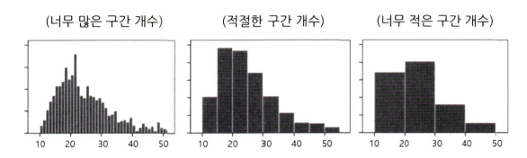

- 막대그래프나 선그래프로 분포를 나타냄
- 히스토그램으로 분포를 단순화
    - 겹치지 않는 변수의 구간을 동일하게 나누어서 구간별 도수를 막대그래프로 표현
    - 각 구간을 bin이라 함
    - 구간의 높이는 밀도, 즉 가로축의 단위 구간에 속한 값의 비율을 나타냄 
    - 구간이 너무 많으면 보기 어렵고 너무 적으면 정보 손실 발생

#### 질적척도

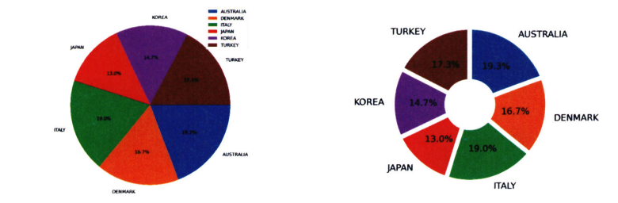
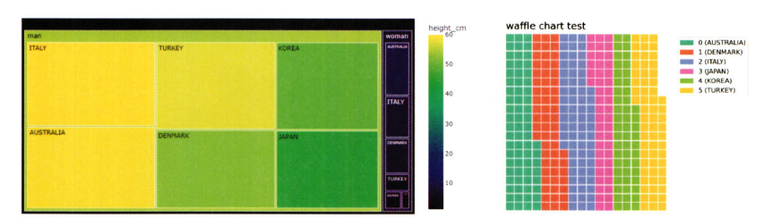

- 파이차트/도넛차트: 구성이 단순한 경우 
    - 전체를 100%로 하여 구성 요소들의 분포 정도를 면적(각도)로 표현
    - 수치를 함께 표시해주는 것이 좋음
    - 도넛차트는 비어있는 가운데 공간에 추가적인 정보 삽입 가능
- 트리맵 차트: 구성요소가 복잡한 질적 척도를 표현
    - 하나의 큰 사각형을 구성 요소의 비율에 따라 작은 사각형으로 쪼개어 분포를 표현
    - 장점: 사각형 안에 더 작은 사각형을 포함시켜서 위계구조를 표현 가능
    - 단점: 구성 요소들 가느이 규모 차이가 크면 표현이 어려울 수 있음
- 와플차트
    - 와플처럼 일정한 네모난 조각들로 분포를 표현
    - 위계구조를 표현하지는 못함

### 관계 시각화

#### 산점도

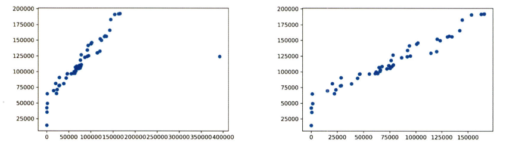
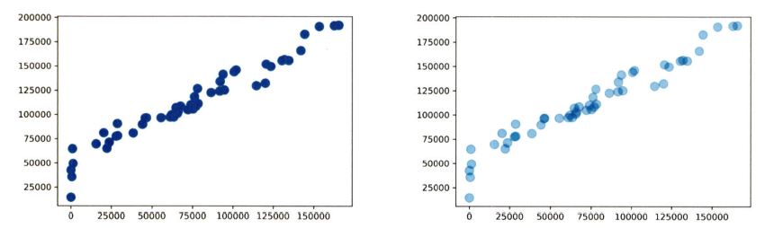

- 단순해서 쉽게 이해하고 표현할 수 있음
- 하나의 요소는 X축, 다른 하나의 요소는 Y축에 대입하여 일치하는 지점에 점 찍음
- 점들의 분포와 추세를 통해 두 변수 간의 관계 파악 가능
- 극단치를 제거하고 그리는 것이 좋음
    - 극단치로 인해 주요 분포 구간이 압축죄어 시각화의 효율 감소
- 데이터가 너무 많아 점들이 겹쳐 정보를 제대로 확인하기 어려울 때, 각각의 점에 투명도를 주어 점들의 밀도를 함께 표현할 수 있음
- 단점: 두 변수 간 관계만 표현 가능

#### 버블차트

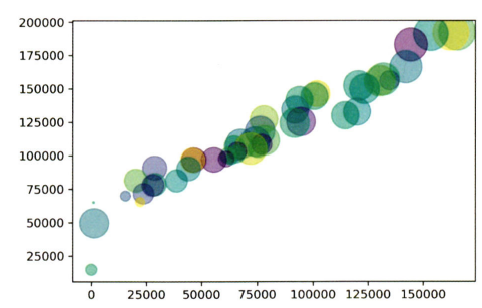

- 세 가지 요소의 상관관계 표현 가능
    - 버블의 크기를 통해 산점도에 비해 한 가지 요소를 추가적으로 볼 수 있음
    - 버블에 색상, 농도 추가도 가능하지만 차트 해석이 어려워짐
    - 애니메이션 요소를 추가하여 시간에 따른 변화도 표현 가능
- 원의 면적을 함께 봐야 하기 때문에 관측치가 너무 많으면 정보 전달의 효율이 떨어짐
    - 관측치가 100개가 넘어갈 경우 데이터를 축약하거나 다른 방법 사용
- 원의 지름이 아닌 면적을 통해 크기를 판단해야함
    - 지름이 두 배 크면 면적은 네 배 큼

### 공간 시각화
~~~
- 데이터가 지리적 위치와 관련되어 있으면 실제 지도 위에 데이터를 표현하는 것이 효과적
- 공간 시각화는 위치 정보인 위도/경도 데이터를 지도에 매핑하여 시각적으로 표현
- 시각화 프로그램에 따라 위도/경도 정보가 없어도 지도에 위치를 표현이 가능하기도 함
- 일반적인 집계 데이터나 그래프보다 데이터를 훨씬 명확하고 직관적으로 볼 수 있음
- 이미지로 표현되는 것이 아닌, 지도를 확대하거나 위치를 옮기는 등 인터랙티브한 활용이 가능
- 거시적에서 미시적으로 진행되는 분석 방향과 같이 스토리라인을 잡고 시각화를 적용하는 것이 좋음
~~~

#### 도트맵(Dot map)

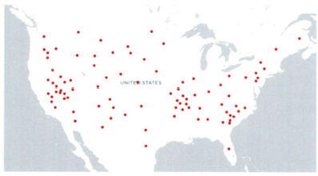

- 지리적 위치에 동일한 크기의 작은 점을 찍어 해당 지역의 데이터 분포나 패턴을 표현
- 점 하나는 실제 하나를 뜻할 수도 있고 다른 단위의 크기를 나타낼 수도 있음
- 장점: 시각적으로 데이터의 개요를 파악하는 데 유리
- 단점: 정확한 값을 전달하는 데에는 적합하지 않음
    - 단점을 보완하기 위해 축소해서 보면 숫자로 정확한 수치를 표현하고 확대하면 점으로 표시되는 기법을 사용

#### 버블맵(Bubble map)

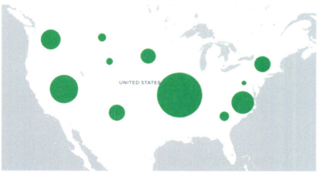

- 버블차트를 지도에 옮겨 둔 것
- 데이터 값이 원의 크기로 표현됨
    - 코로플레스맵보다 비율을 비교하는 것이 효과적
- 단점: 지나치게 큰 버블이 다른 지역의 버블과 영역이 겹칠 수 있기에 이를 잘 조절해야함

#### 코로플레스맵(Choropleth map)

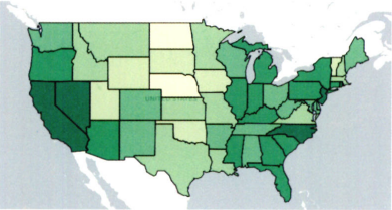

- 단계 구분도라고도 함
- 데이터 값의 크기에 따라 색상의 음영을 달리하여 해당 지역에 대한 값을 시각화
- 경우에 따라 여러 색상을 혼합할 수 있으며, 투명도/명도/채도 등 다양하게 표현 가능
- 단점
    - 정확한 수치를 인지하고 비교하는 것이 어려움
    - 작은 지역들에 비해 큰 지역이 강조되는 인상을 줄 수 있음

#### 커넥션맵(Connection map) & 링크맵(Link map)

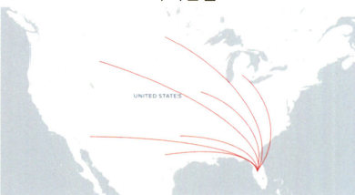

- 지도에 찍힌 점들을 곡선 또는 직선으로 연결하여 지리적 관계를 표현
- 연속적 연결을 통해 지도에 경로 표현 가능
- 일반적으로 연결선의 분포와 집중도를 통해 지리적 관계의 패턴을 파악하기 위해 사용
- 지역 간의 무역 관계나 항공 경로나 통신 정보 흐름 등을 표현할 때 사용

#### 그 외의 공간 시각화 방법
- 플로우맵(Flow map): 커넥션맵과 유사하게 선을 표현하지만 시작점과 도착점이 함께 표현됨
- 카토그램: 각 지역의 면적을 데이터 값에 비례하도록 변형시켜 시각화
- 지도 위에 바 차트나 파이차트 등을 표현

### 박스 플롯

#### 박스플롯 개요

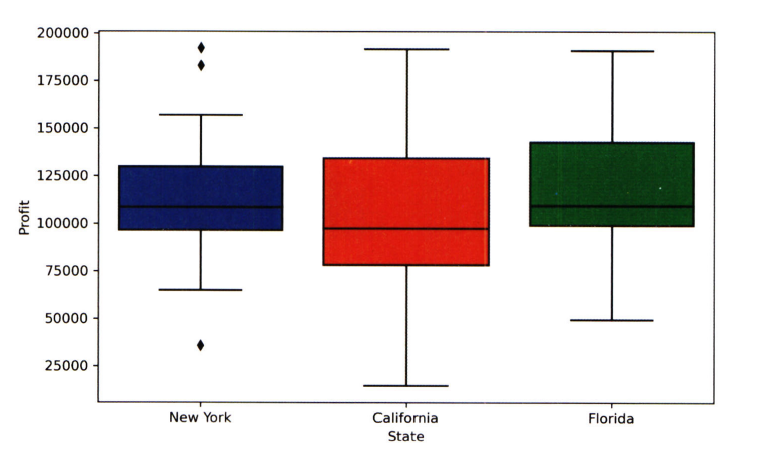

- 상자 수염 그림으로도 불림
- 네모 상자 모양에 최댓값과 최솟값을 나타내는 선이 결합된 모양의 데이터 시각화 방법
- 하나의 그림으로 양적 척도 데이터의 분포 및 편향성, 평균과 중앙값 등 다양한 수치를 보기 쉽게 정리해줌
- 특히 두 변수의 값을 비교할 때 효과적
- 항상 데이터 분포도를 함께 떠올리며 해석해야 함
 
#### 박스플롯의 사용
- 데이터의 대체적인 분포 형태를 쉽게 확인하기 위해 사용
- 카테고리별 분포를 비교할 때 사용
- 데이터의 속성을 유추할 수 있는 5개의 대표적인 수치를 그림으로 표현
- 데이터 활용 시의 유의점을 인식할 수 있고 분석 방향을 잡을 수 있음
- 박스 플롯의 다섯가지 수치
    1. 최솟값: 제1사분위에서 1.5 IQR을 뺀 위치
    2. 제1사분위(Q1): 25%의 위치
    3. 제2사분위(Q2): 50%의 위치, 중앙값(median)
    4. 제3사분위(Q3): 75%의 위치
    5. 최댓값: 제3사분위에서 1.5 IQR을 더한 위치
        - IQR: 3사분위 수에서 1사분위 수를 뺀 사분위수 범위
- 때에 따라서는 위 다섯 수치에 더해 평균값도 함께 표현함
- 각 최솟값과 최댓값의 범위를 넘어가는 값은 이상치로서 작은 원으로 표시

#### 박스플롯의 구조

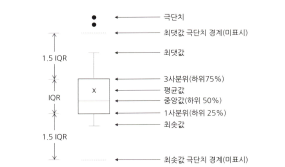

- 크기 순서가 하위 25%부터 75% 사이에 해당하는 값은 네모 상자로 나타냄
- 위로 뻗은 수염의 끝은 네모 상자 맨 위 값의 1.5배에 해당하는 값을 의미
    - 이를 이상치를 제외한 최댓값으로 봄
- 네모 상자에 해당하는 영역이 IQR
- 상자 내부 가로선은 50% 지점, 즉 중위수 위치


<br>
<br>

---

# 2️⃣ 확인 과제

> **교재에 있는 실습 파트를 직접 따라 해보세요. 실습을 완료한 뒤, 결과화면(캡처 또는 코드 결과)을 첨부하여 인증해 주세요.단순 이론 암기보다, 직접 손으로 따라해보면서 실습해 보는 것이 가장 확실한 학습 방법입니다.**
>
> > **인증 예시 : 통계 프로그램 결과, 시각화 이미지 캡처 등**

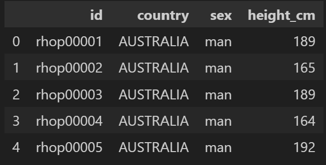
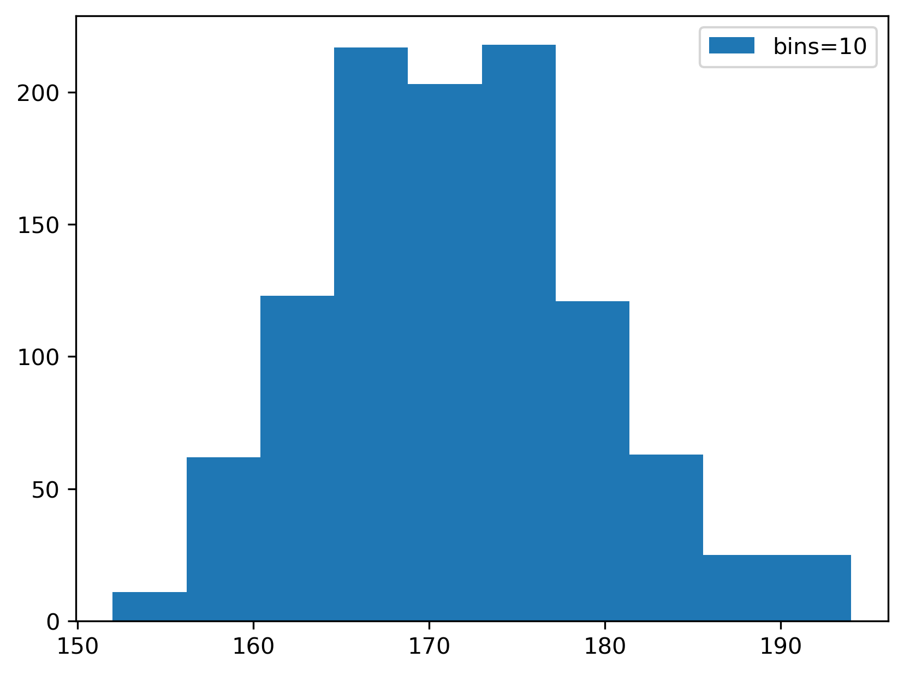
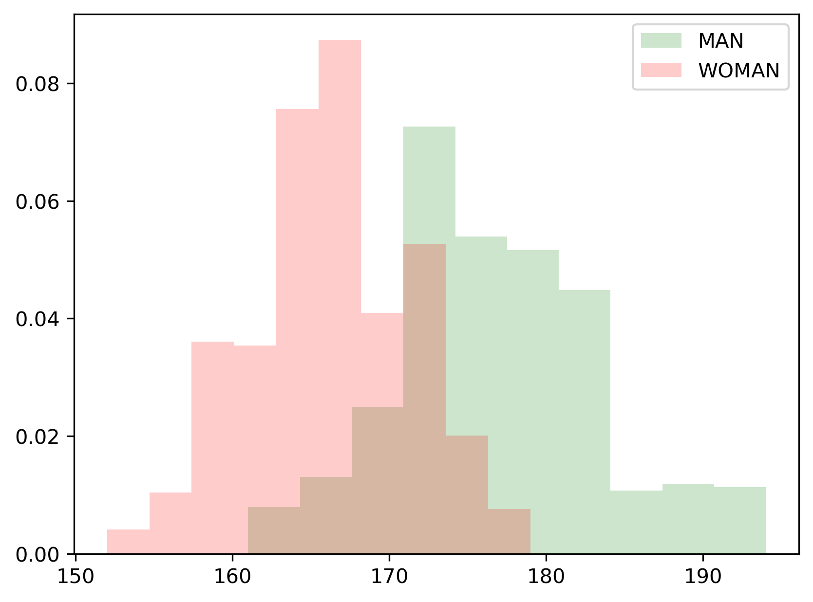
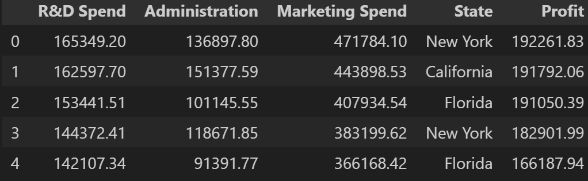
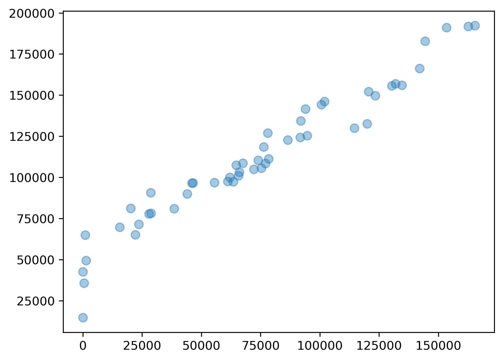
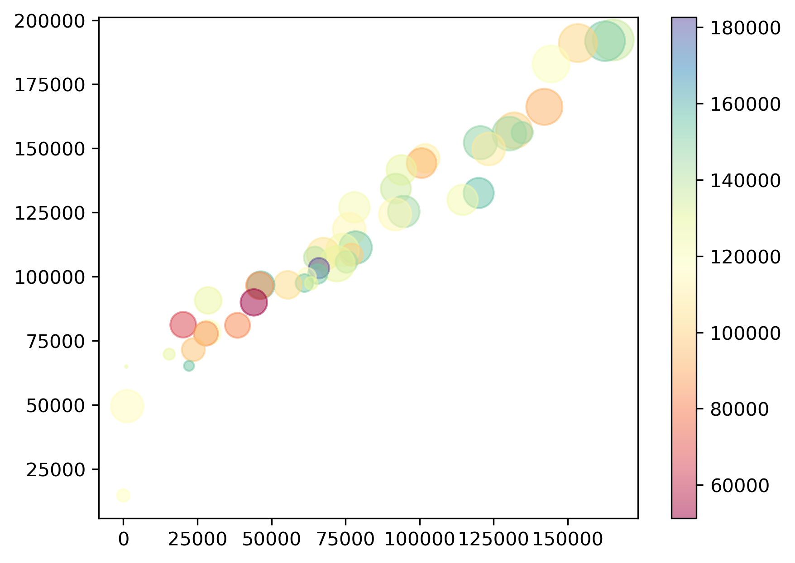

~~~
인증 이미지가 없으면 과제 수행으로 인정되지 않습니다.
~~~


### 🎉 수고하셨습니다.
